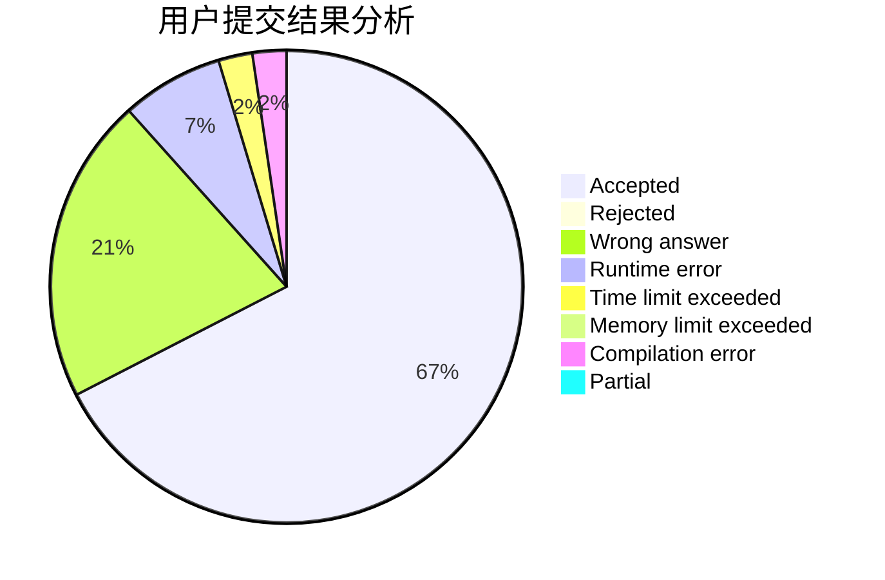
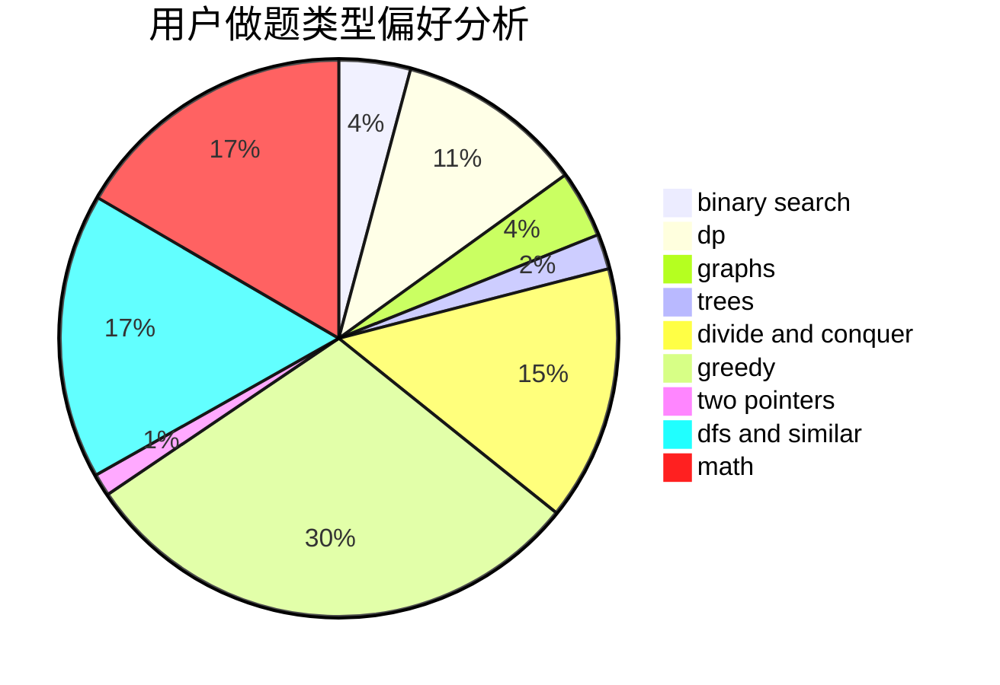

# 17B26LinZhengYu

<!-- tabs:start -->

#### **用户提交结果分析**

#### **用户做题类型偏好分析**

<!-- tabs:end -->
# 推荐题目
[11841](https://codeforces.com/contest/1184/problem/1)
[1183G](https://codeforces.com/contest/1183/problem/G)
[1183H](https://codeforces.com/contest/1183/problem/H)
[1087D](https://codeforces.com/contest/1087/problem/D)
[1182C](https://codeforces.com/contest/1182/problem/C)
[1183E](https://codeforces.com/contest/1183/problem/E)
[1181D](https://codeforces.com/contest/1181/problem/D)
[1182F](https://codeforces.com/contest/1182/problem/F)
[1180D](https://codeforces.com/contest/1180/problem/D)
[1180C](https://codeforces.com/contest/1180/problem/C)
