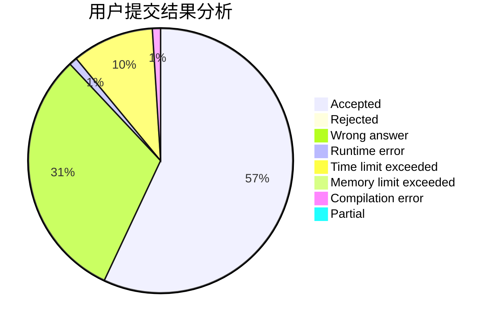
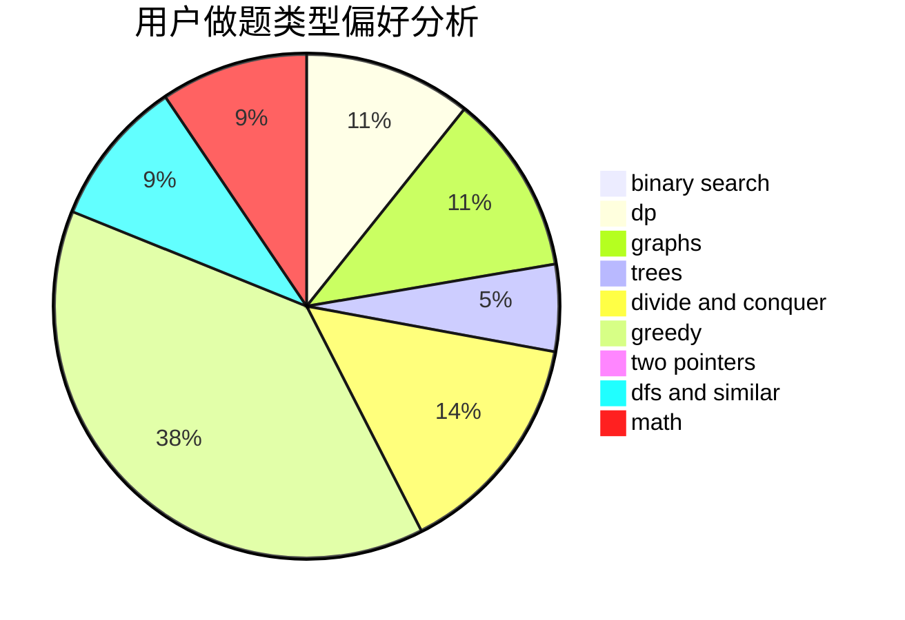

# ChenYibai

<!-- tabs:start -->

#### **用户提交结果分析**

#### **用户做题类型偏好分析**

<!-- tabs:end -->
# 推荐题目
[45G](https://codeforces.com/contest/45/problem/G)
[442B](https://codeforces.com/contest/442/problem/B)
[1223A](https://codeforces.com/contest/1223/problem/A)
[69A](https://codeforces.com/contest/69/problem/A)
[1188E](https://codeforces.com/contest/1188/problem/E)
[1181B](https://codeforces.com/contest/1181/problem/B)
[1010A](https://codeforces.com/contest/1010/problem/A)
[107D](https://codeforces.com/contest/107/problem/D)
[6C](https://codeforces.com/contest/6/problem/C)
[286B](https://codeforces.com/contest/286/problem/B)
