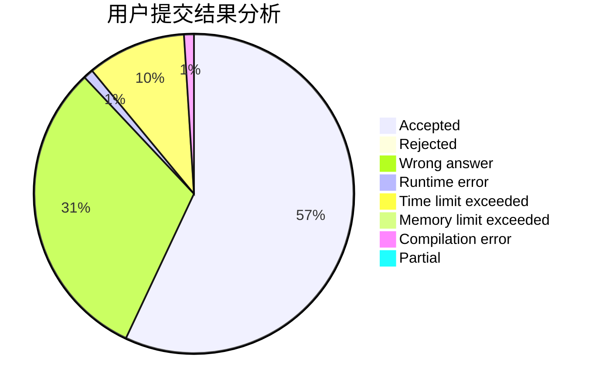
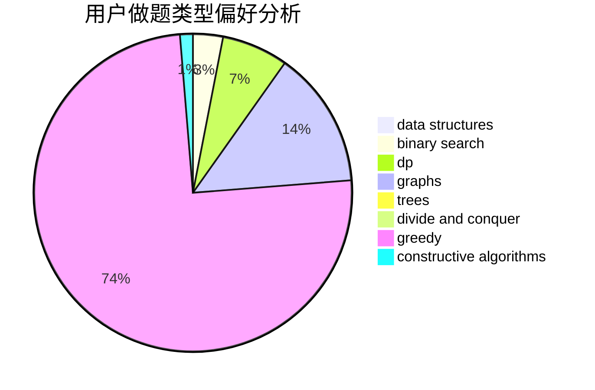
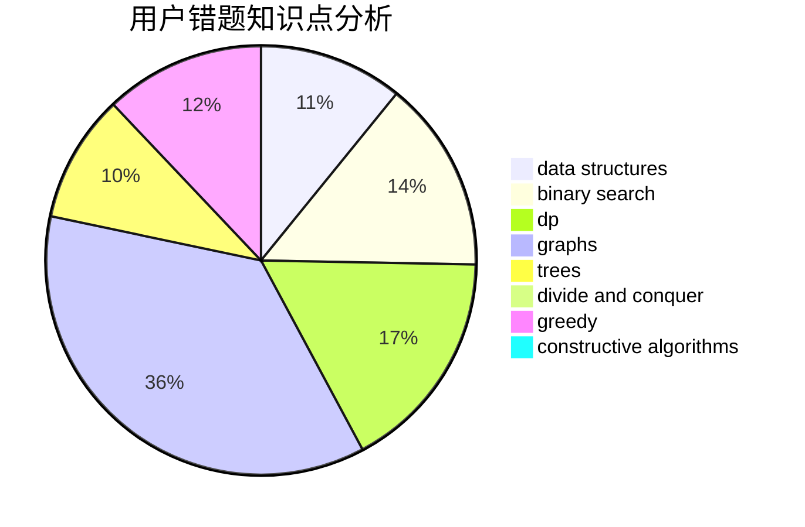

# ChenYibai

<!-- tabs:start -->

#### **用户提交结果分析**

#### **用户做题类型偏好分析**

#### **用户错题知识点分析**

<!-- tabs:end -->
# 推荐题目
[438B](https://codeforces.com/contest/438/problem/B)		dsu,graphs,sortings,trees		  
[417C](https://codeforces.com/contest/417/problem/C)		constructive algorithms,
                        graphs,
                        implementation		  
[1216D](https://codeforces.com/contest/1216/problem/D)		math		  
[675A](https://codeforces.com/contest/675/problem/A)		math		  
[1184E3](https://codeforces.com/contest/1184E/problem/3)		data structures,
                        dsu,
                        graphs,
                        trees		  
[1178F2](https://codeforces.com/contest/1178F/problem/2)		dp		  
[1009F](https://codeforces.com/contest/1009/problem/F)		data structures,
                        dsu,
                        trees		  
[107A](https://codeforces.com/contest/107/problem/A)		dfs and similar,
                        graphs		  
[675D](https://codeforces.com/contest/675/problem/D)		data structures,
                        trees		  
[26A](https://codeforces.com/contest/26/problem/A)		number theory		  
