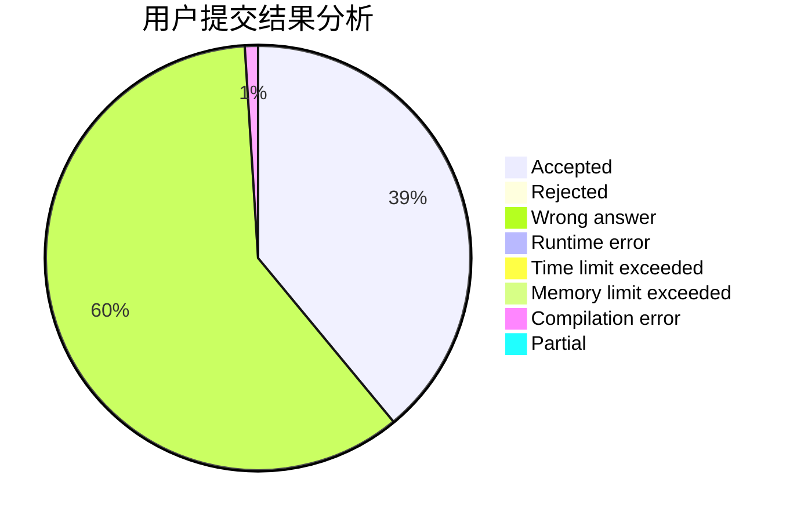
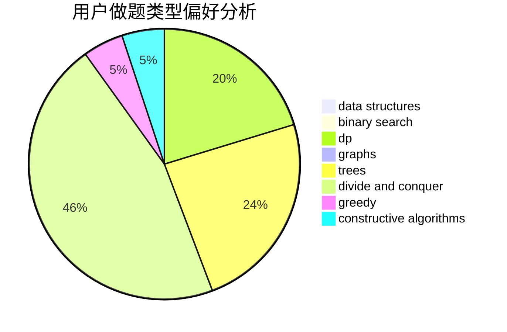
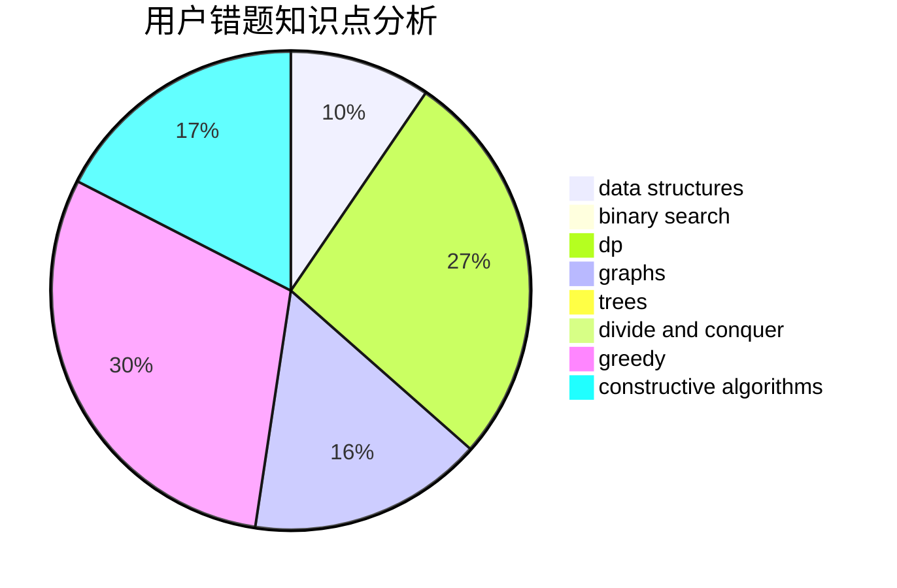

# zhigu

<!-- tabs:start -->

#### **用户提交结果分析**

#### **用户做题类型偏好分析**

#### **用户错题知识点分析**

<!-- tabs:end -->
# 推荐题目
[121C](https://codeforces.com/contest/121/problem/C)		brute force,
                        combinatorics,
                        number theory		  
[1384E](https://codeforces.com/contest/1384/problem/E)		dsu,graphs,sortings,trees		  
[664A](https://codeforces.com/contest/664/problem/A)		math,
                        number theory		  
[54A](https://codeforces.com/contest/54/problem/A)		implementation		  
[1042C](https://codeforces.com/contest/1042/problem/C)		constructive algorithms,
                        greedy,
                        math		  
[732F](https://codeforces.com/contest/732/problem/F)		dfs and similar,
                        graphs		  
[656D](https://codeforces.com/contest/656/problem/D)		*special problem		  
[601B](https://codeforces.com/contest/601/problem/B)		data structures,
                        math		  
[984D](https://codeforces.com/contest/984/problem/D)		dsu,graphs,sortings,trees		  
[1149A](https://codeforces.com/contest/1149/problem/A)		constructive algorithms,
                        greedy,
                        math,
                        number theory		  
