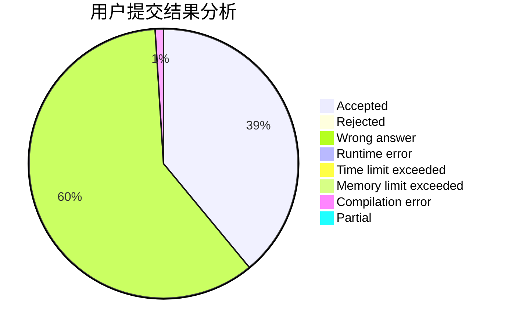
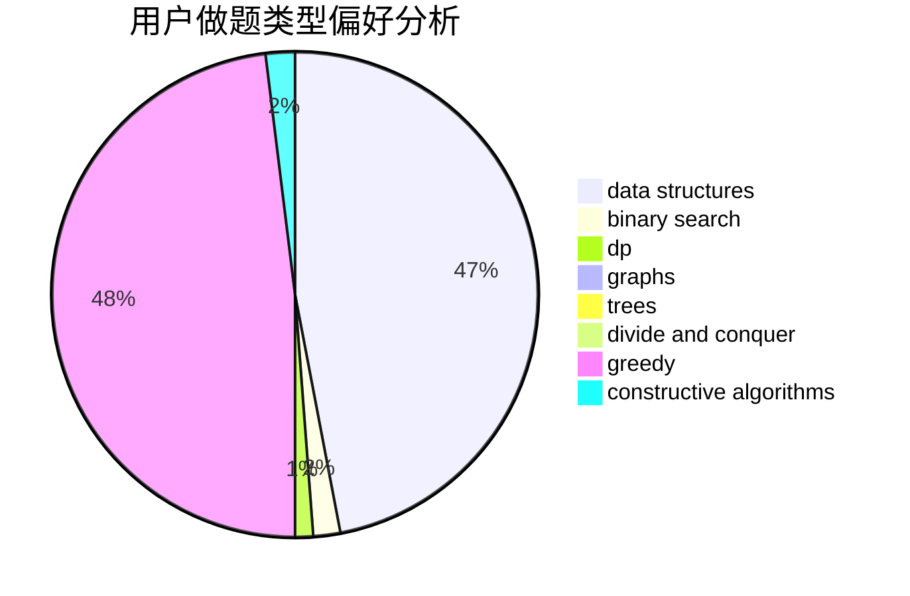
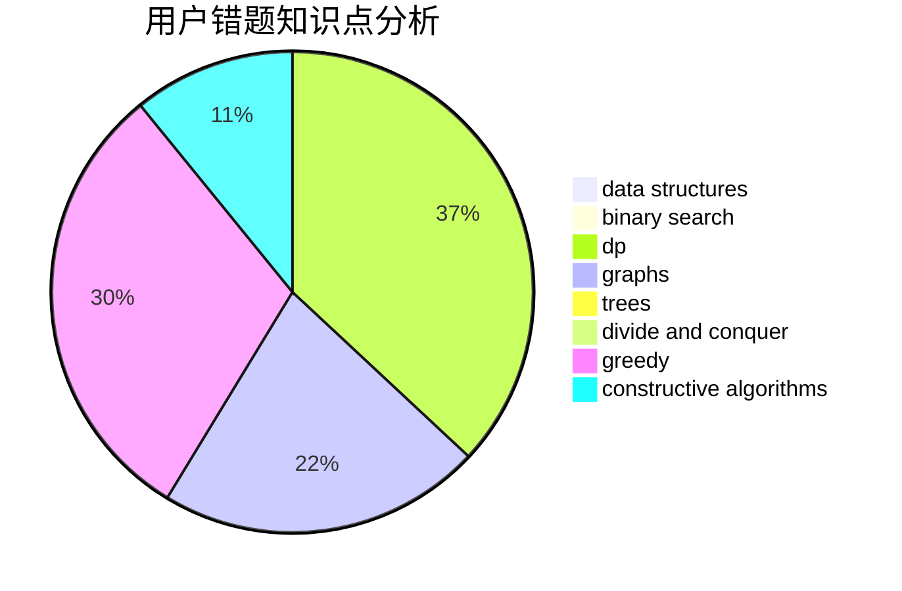

# zhigu

<!-- tabs:start -->

#### **用户提交结果分析**

#### **用户做题类型偏好分析**

#### **用户错题知识点分析**

<!-- tabs:end -->
# 推荐题目
[1227A](https://codeforces.com/contest/1227/problem/A)		math		  
[1394E](https://codeforces.com/contest/1394/problem/E)		strings		  
[683B](https://codeforces.com/contest/683/problem/B)		*special problem		  
[575A](https://codeforces.com/contest/575/problem/A)		data structures,
                        math,
                        matrices		  
[1042F](https://codeforces.com/contest/1042/problem/F)		data structures,
                        dfs and similar,
                        dsu,
                        graphs,
                        greedy,
                        sortings,
                        trees		  
[750E](https://codeforces.com/contest/750/problem/E)		data structures,
                        divide and conquer,
                        dp,
                        matrices		  
[678D](https://codeforces.com/contest/678/problem/D)		math,
                        number theory		  
[620D](https://codeforces.com/contest/620/problem/D)		binary search,
                        two pointers		  
[99C](https://codeforces.com/contest/99/problem/C)		dsu,graphs,sortings,trees		  
[1150D](https://codeforces.com/contest/1150/problem/D)		dsu,graphs,sortings,trees		  
