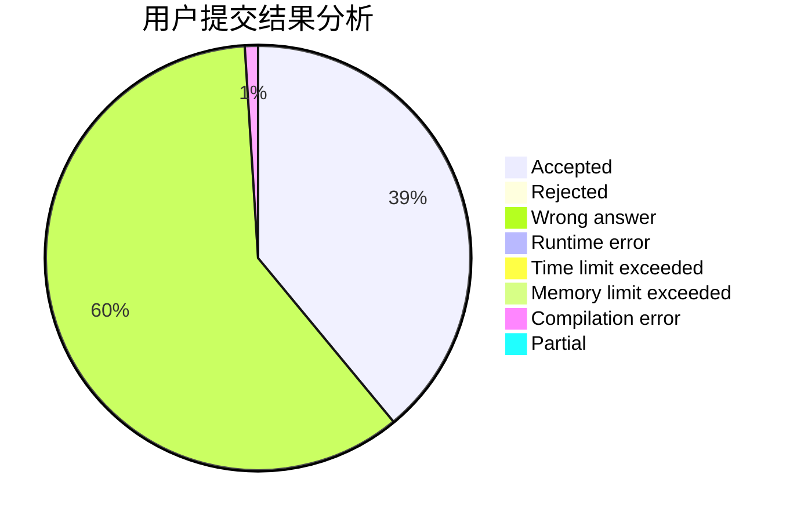
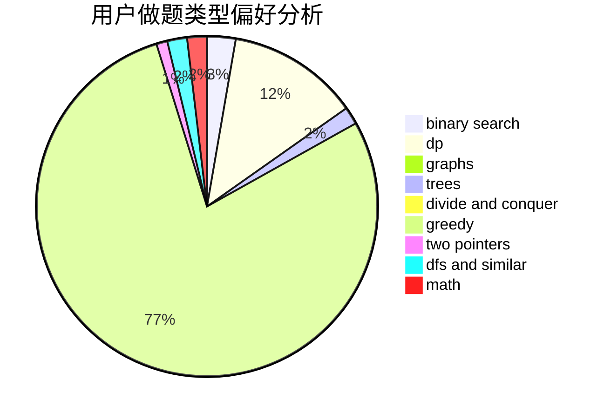

# zhigu

<!-- tabs:start -->

#### **用户提交结果分析**

#### **用户做题类型偏好分析**

<!-- tabs:end -->
# 推荐题目
[1227A](https://codeforces.com/contest/1227/problem/A)
[1394E](https://codeforces.com/contest/1394/problem/E)
[683B](https://codeforces.com/contest/683/problem/B)
[575A](https://codeforces.com/contest/575/problem/A)
[1042F](https://codeforces.com/contest/1042/problem/F)
[750E](https://codeforces.com/contest/750/problem/E)
[678D](https://codeforces.com/contest/678/problem/D)
[620D](https://codeforces.com/contest/620/problem/D)
[99C](https://codeforces.com/contest/99/problem/C)
[1150D](https://codeforces.com/contest/1150/problem/D)
