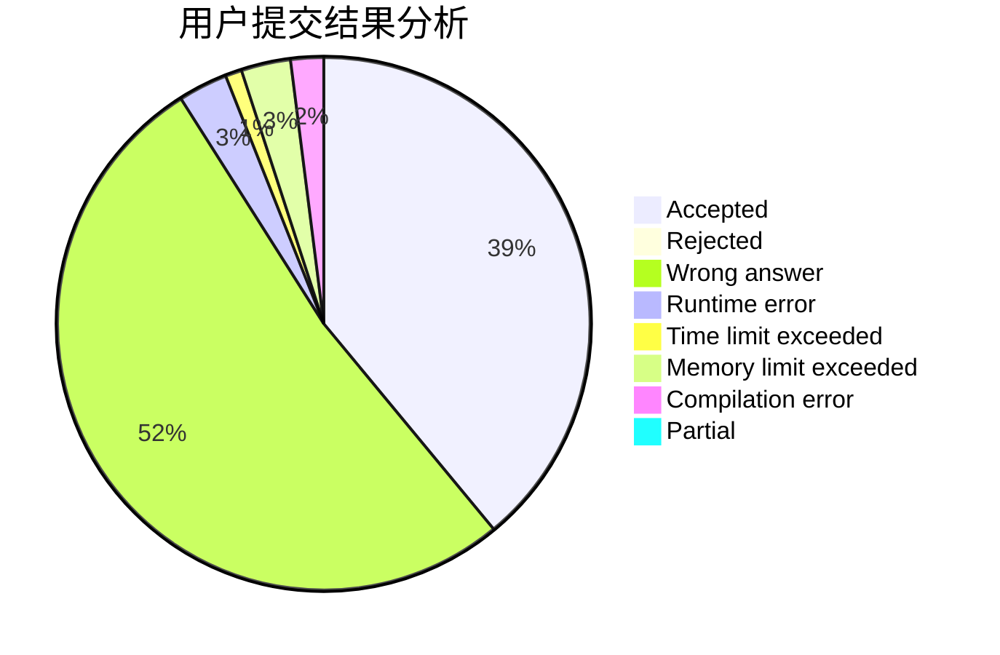
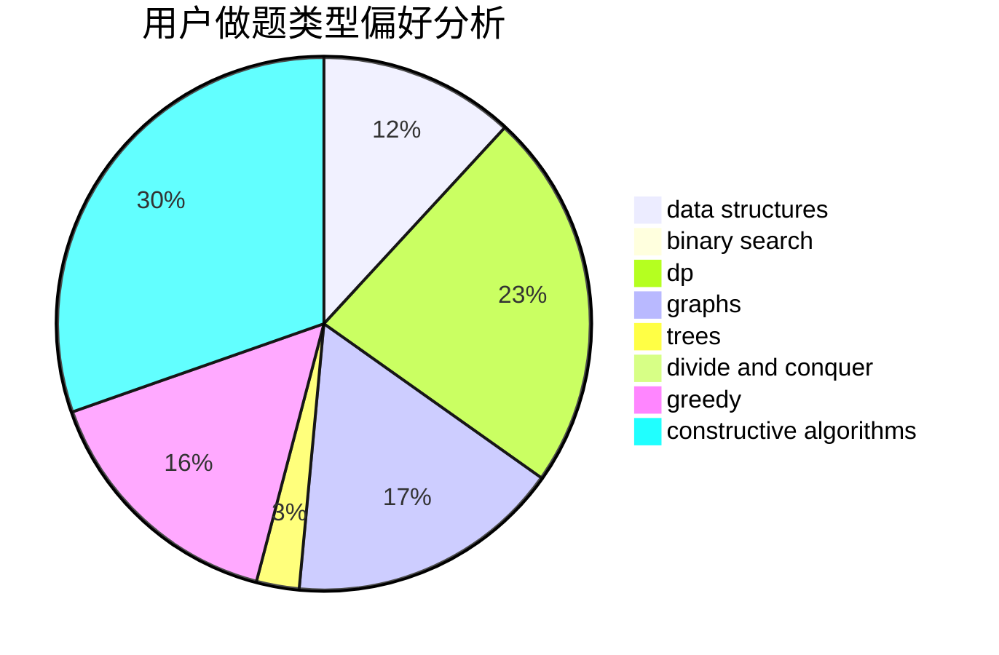

# zhl

<!-- tabs:start -->

#### **用户提交结果分析**

#### **用户做题类型偏好分析**

#### **用户错题知识点分析**

<!-- tabs:end -->
# 推荐题目
[1202C](https://codeforces.com/contest/1202/problem/C)		brute force,
                        data structures,
                        dp,
                        greedy,
                        implementation,
                        math,
                        strings		  
[1346D](https://codeforces.com/contest/1346/problem/D)		*special problem,
                        graphs,
                        greedy		  
[392B](https://codeforces.com/contest/392/problem/B)		dp		  
[1374D](https://codeforces.com/contest/1374/problem/D)		math,
                        sortings,
                        two pointers		  
[479B](https://codeforces.com/contest/479/problem/B)		brute force,
                        constructive algorithms,
                        greedy,
                        implementation,
                        sortings		  
[1353B](https://codeforces.com/contest/1353/problem/B)		greedy,
                        sortings		  
[768E](https://codeforces.com/contest/768/problem/E)		bitmasks,
                        dp,
                        games		  
[552A](https://codeforces.com/contest/552/problem/A)		implementation,
                        math		  
[1186C](https://codeforces.com/contest/1186/problem/C)		implementation,
                        math		  
[750H](https://codeforces.com/contest/750/problem/H)		dfs and similar,
                        dsu,
                        graphs,
                        interactive		  
