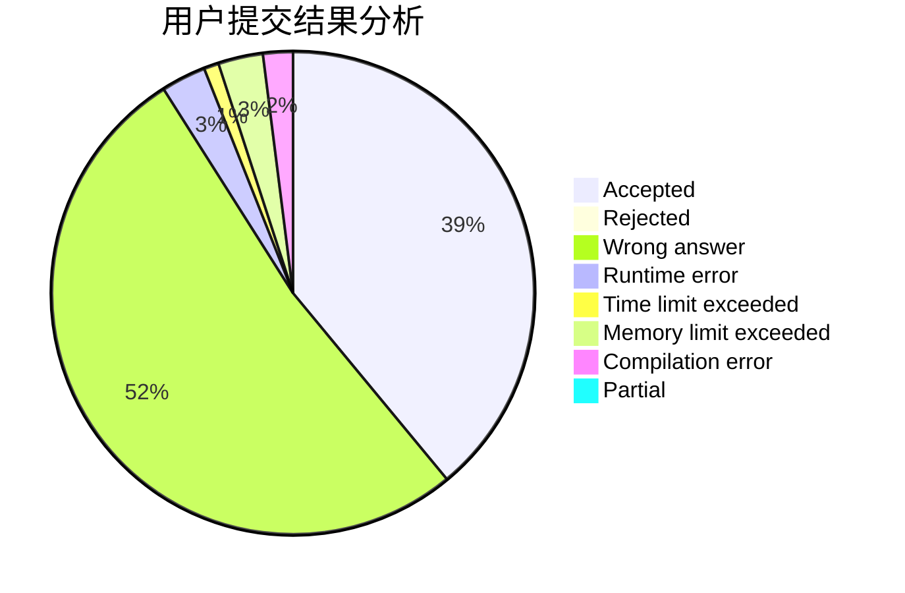
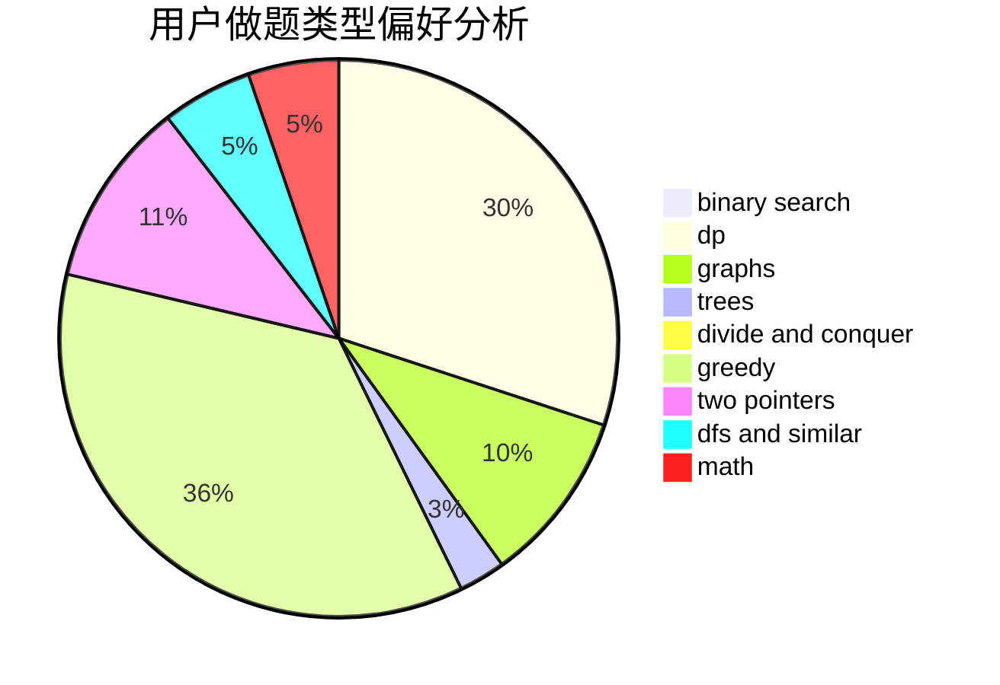

# zhl

<!-- tabs:start -->

#### **用户提交结果分析**

#### **用户做题类型偏好分析**

<!-- tabs:end -->
# 推荐题目
[1202C](https://codeforces.com/contest/1202/problem/C)
[1346D](https://codeforces.com/contest/1346/problem/D)
[392B](https://codeforces.com/contest/392/problem/B)
[1374D](https://codeforces.com/contest/1374/problem/D)
[479B](https://codeforces.com/contest/479/problem/B)
[1353B](https://codeforces.com/contest/1353/problem/B)
[768E](https://codeforces.com/contest/768/problem/E)
[552A](https://codeforces.com/contest/552/problem/A)
[1186C](https://codeforces.com/contest/1186/problem/C)
[750H](https://codeforces.com/contest/750/problem/H)
