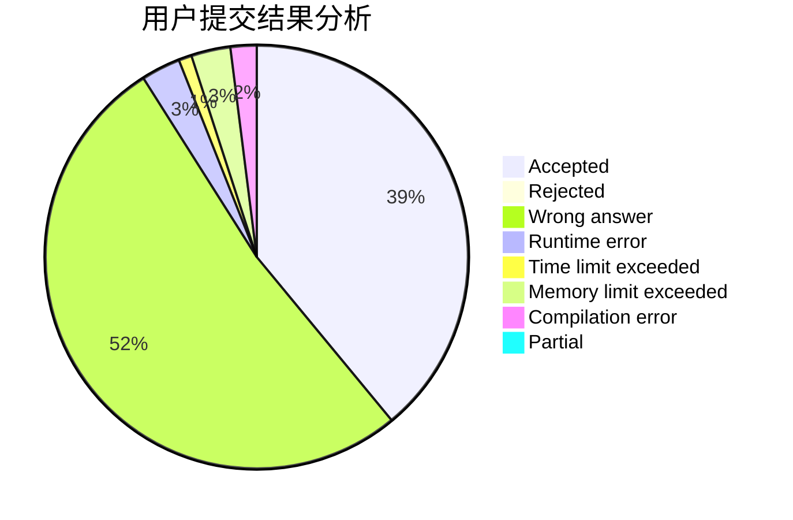
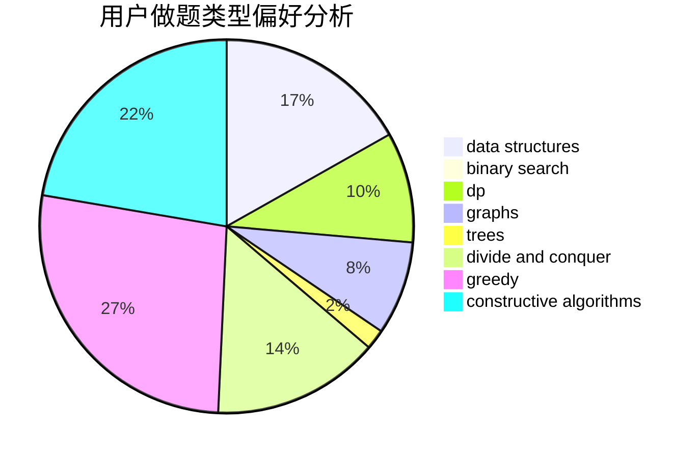

# zhl

<!-- tabs:start -->

#### **用户提交结果分析**

#### **用户做题类型偏好分析**

#### **用户错题知识点分析**

<!-- tabs:end -->
# 推荐题目
[1198E](https://codeforces.com/contest/1198/problem/E)		flows,
                        graph matchings,
                        graphs		  
[1339D](https://codeforces.com/contest/1339/problem/D)		dsu,graphs,sortings,trees		  
[364E](https://codeforces.com/contest/364/problem/E)		divide and conquer,
                        two pointers		  
[1367F2](https://codeforces.com/contest/1367F/problem/2)		binary search,
                        data structures,
                        dp,
                        greedy,
                        sortings,
                        two pointers		  
[45G](https://codeforces.com/contest/45/problem/G)		number theory		  
[1346A](https://codeforces.com/contest/1346/problem/A)		*special problem,
                        math		  
[749E](https://codeforces.com/contest/749/problem/E)		data structures,
                        probabilities		  
[528A](https://codeforces.com/contest/528/problem/A)		dsu,graphs,sortings,trees		  
[1183E](https://codeforces.com/contest/1183/problem/E)		dp,
                        graphs,
                        implementation,
                        shortest paths		  
[733C](https://codeforces.com/contest/733/problem/C)		constructive algorithms,
                        dp,
                        greedy,
                        two pointers		  
