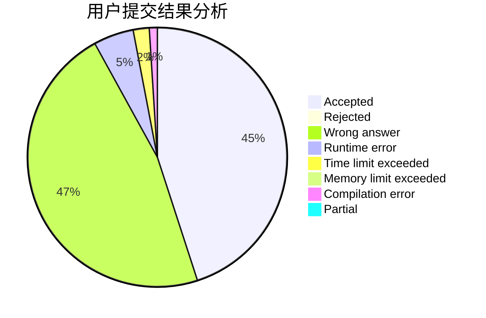
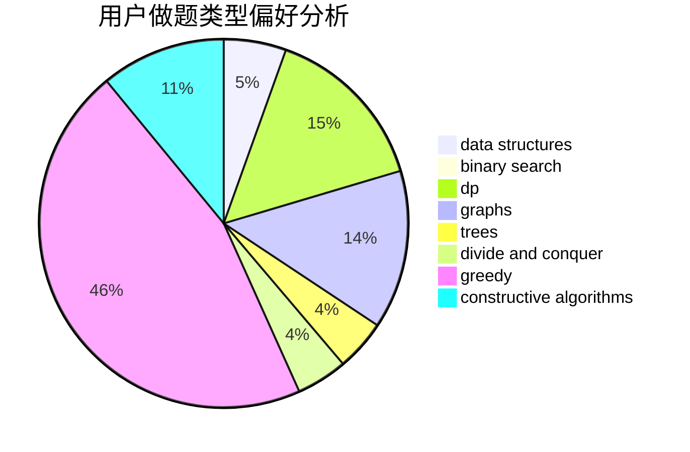
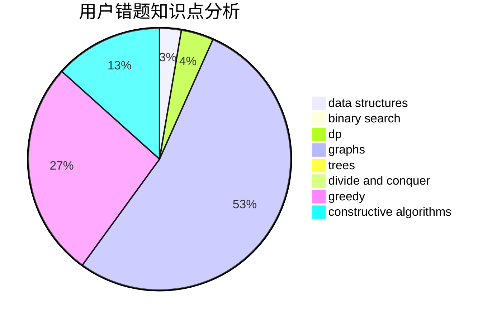

# zhmeng

<!-- tabs:start -->

#### **用户提交结果分析**

#### **用户做题类型偏好分析**

#### **用户错题知识点分析**

<!-- tabs:end -->
# 推荐题目
[1436A](https://codeforces.com/contest/1436/problem/A)		math		  
[377E](https://codeforces.com/contest/377/problem/E)		dp,
                        geometry		  
[799F](https://codeforces.com/contest/799/problem/F)		data structures		  
[778C](https://codeforces.com/contest/778/problem/C)		brute force,
                        dfs and similar,
                        dsu,
                        hashing,
                        strings,
                        trees		  
[955A](https://codeforces.com/contest/955/problem/A)		greedy,
                        math		  
[678A](https://codeforces.com/contest/678/problem/A)		implementation,
                        math		  
[753C](https://codeforces.com/contest/753/problem/C)		brute force,
                        constructive algorithms,
                        interactive		  
[21D](https://codeforces.com/contest/21/problem/D)		bitmasks,
                        graph matchings,
                        graphs		  
[786B](https://codeforces.com/contest/786/problem/B)		data structures,
                        graphs,
                        shortest paths		  
[241E](https://codeforces.com/contest/241/problem/E)		graphs,
                        shortest paths		  
