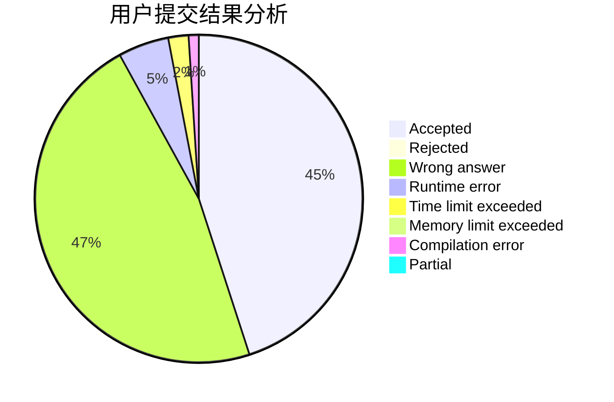
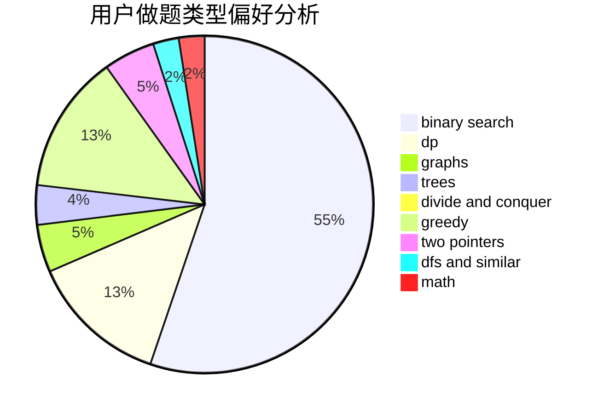

# zhmeng

<!-- tabs:start -->

#### **用户提交结果分析**

#### **用户做题类型偏好分析**

<!-- tabs:end -->
# 推荐题目
[14461](https://codeforces.com/contest/1446/problem/1)
[407B](https://codeforces.com/contest/407/problem/B)
[813F](https://codeforces.com/contest/813/problem/F)
[796D](https://codeforces.com/contest/796/problem/D)
[977A](https://codeforces.com/contest/977/problem/A)
[701E](https://codeforces.com/contest/701/problem/E)
[771E](https://codeforces.com/contest/771/problem/E)
[23B](https://codeforces.com/contest/23/problem/B)
[802L](https://codeforces.com/contest/802/problem/L)
[263C](https://codeforces.com/contest/263/problem/C)
