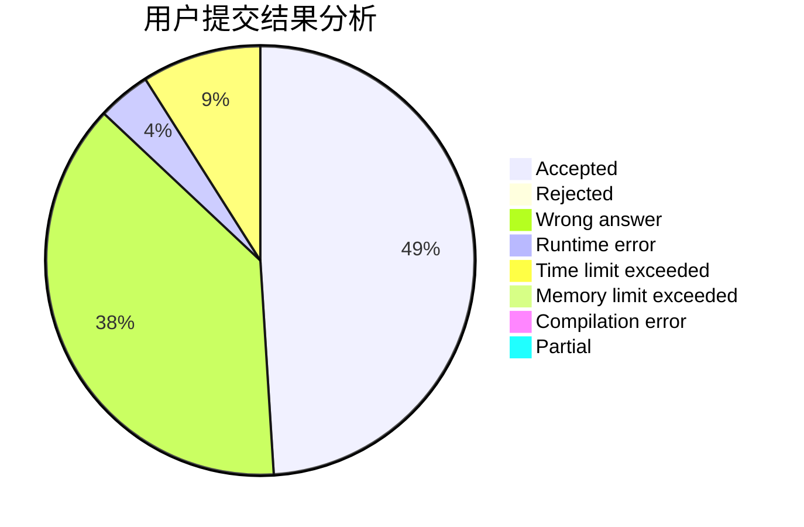
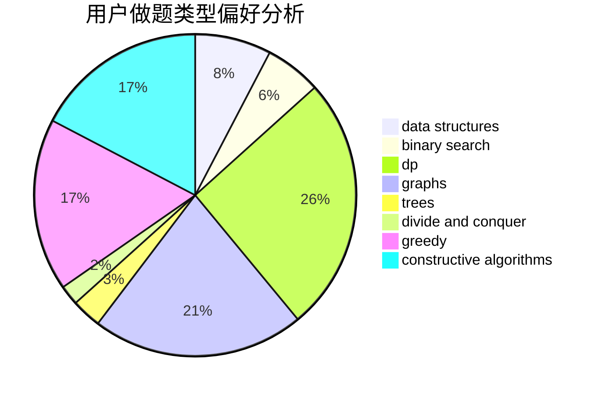
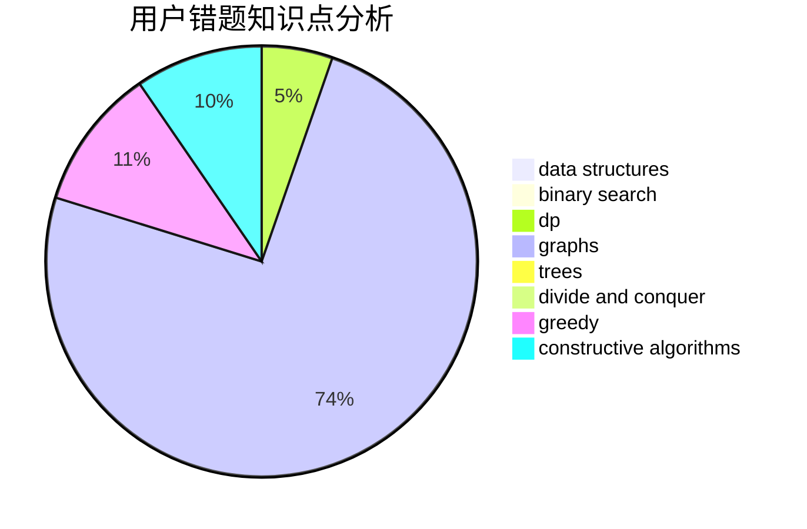

# zhongshuren

<!-- tabs:start -->

#### **用户提交结果分析**

#### **用户做题类型偏好分析**

#### **用户错题知识点分析**

<!-- tabs:end -->
# 推荐题目
[1357C2](https://codeforces.com/contest/1357C/problem/2)		nan		  
[121E](https://codeforces.com/contest/121/problem/E)		data structures		  
[269B](https://codeforces.com/contest/269/problem/B)		dp		  
[1087A](https://codeforces.com/contest/1087/problem/A)		dsu,graphs,sortings,trees		  
[1349F2](https://codeforces.com/contest/1349F/problem/2)		dp,
                        fft,
                        math		  
[127A](https://codeforces.com/contest/127/problem/A)		geometry		  
[159D](https://codeforces.com/contest/159/problem/D)		*special problem,
                        brute force,
                        dp,
                        strings		  
[1333F](https://codeforces.com/contest/1333/problem/F)		greedy,
                        implementation,
                        math,
                        number theory,
                        sortings,
                        two pointers		  
[453B](https://codeforces.com/contest/453/problem/B)		bitmasks,
                        brute force,
                        dp		  
[1178F2](https://codeforces.com/contest/1178F/problem/2)		dp		  
