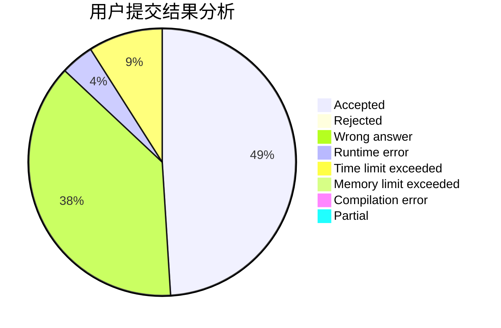
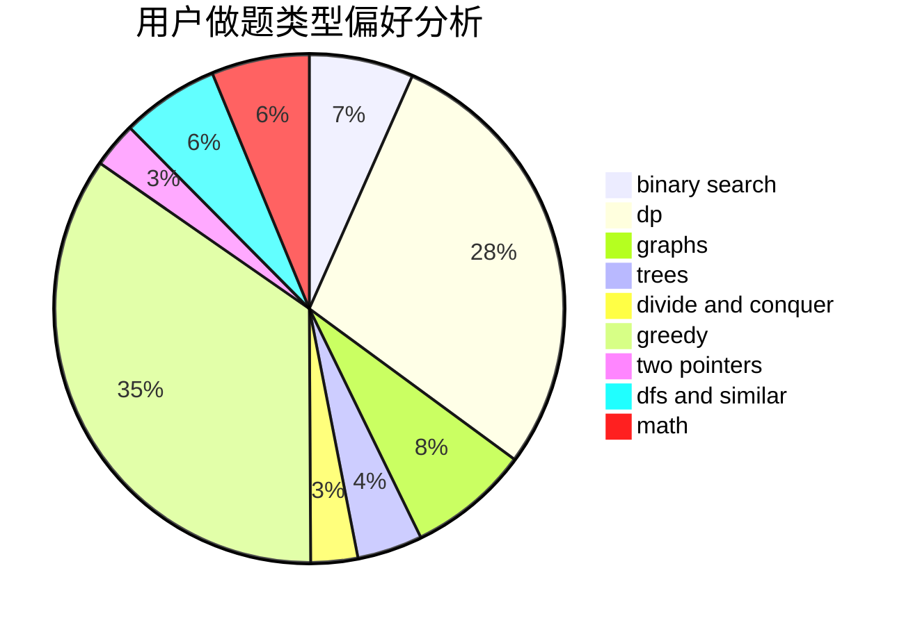

# zhongshuren

<!-- tabs:start -->

#### **用户提交结果分析**

#### **用户做题类型偏好分析**

<!-- tabs:end -->
# 推荐题目
[1365B](https://codeforces.com/contest/1365/problem/B)
[1227G](https://codeforces.com/contest/1227/problem/G)
[284E](https://codeforces.com/contest/284/problem/E)
[1087D](https://codeforces.com/contest/1087/problem/D)
[13572](https://codeforces.com/contest/1357/problem/2)
[12862](https://codeforces.com/contest/1286/problem/2)
[181A](https://codeforces.com/contest/181/problem/A)
[1340E](https://codeforces.com/contest/1340/problem/E)
[475A](https://codeforces.com/contest/475/problem/A)
[1181B](https://codeforces.com/contest/1181/problem/B)
