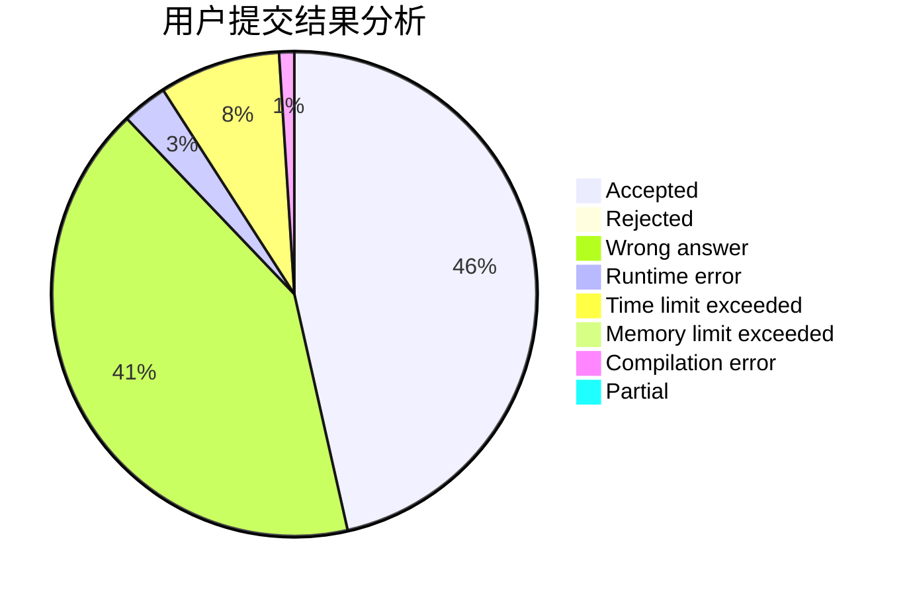
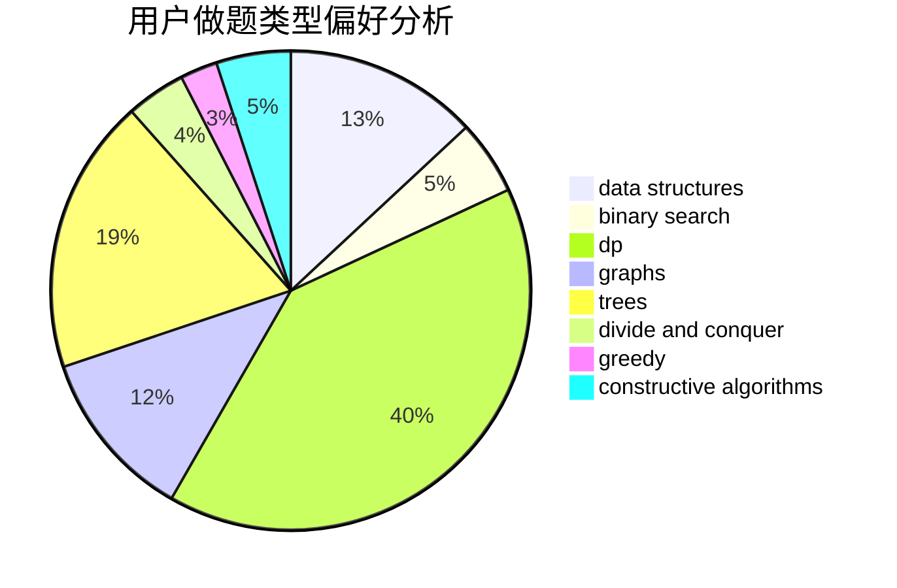
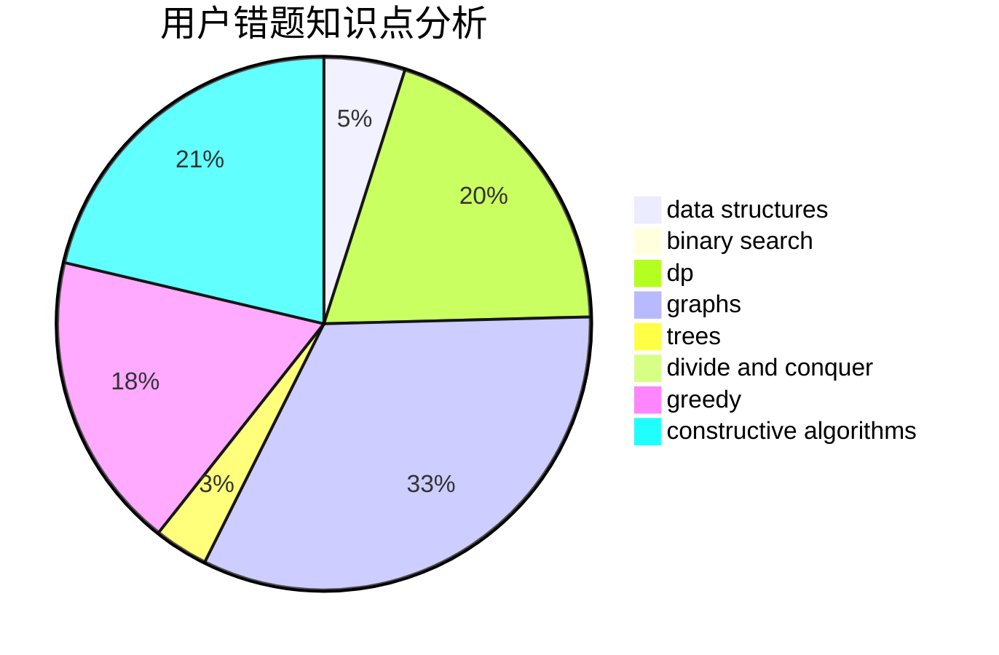

# zhou.xf

<!-- tabs:start -->

#### **用户提交结果分析**

#### **用户做题类型偏好分析**

#### **用户错题知识点分析**

<!-- tabs:end -->
# 推荐题目
[3912](https://codeforces.com/contest/391/problem/2)		dsu,graphs,sortings,trees		  
[424D](https://codeforces.com/contest/424/problem/D)		binary search,
                        brute force,
                        constructive algorithms,
                        data structures,
                        dp		  
[1251D](https://codeforces.com/contest/1251/problem/D)		binary search,
                        greedy,
                        sortings		  
[513C](https://codeforces.com/contest/513/problem/C)		bitmasks,
                        probabilities		  
[145C](https://codeforces.com/contest/145/problem/C)		combinatorics,
                        dp,
                        math		  
[10022](https://codeforces.com/contest/1002/problem/2)		dsu,graphs,sortings,trees		  
[434A](https://codeforces.com/contest/434/problem/A)		dsu,graphs,sortings,trees		  
[1488H](https://codeforces.com/contest/1488/problem/H)		*special problem,
                        combinatorics,
                        data structures		  
[1176E](https://codeforces.com/contest/1176/problem/E)		dfs and similar,
                        dsu,
                        graphs,
                        shortest paths,
                        trees		  
[858C](https://codeforces.com/contest/858/problem/C)		dp,
                        greedy,
                        implementation		  
