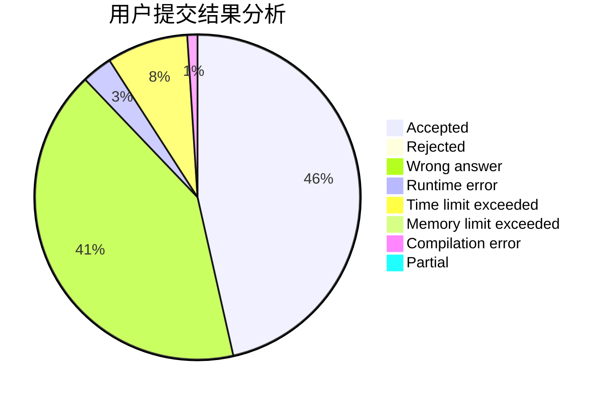
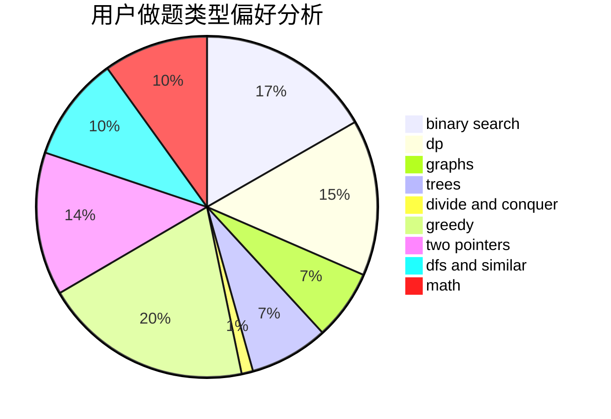

# zhou.xf

<!-- tabs:start -->

#### **用户提交结果分析**

#### **用户做题类型偏好分析**

<!-- tabs:end -->
# 推荐题目
[3912](https://codeforces.com/contest/391/problem/2)
[424D](https://codeforces.com/contest/424/problem/D)
[1251D](https://codeforces.com/contest/1251/problem/D)
[513C](https://codeforces.com/contest/513/problem/C)
[145C](https://codeforces.com/contest/145/problem/C)
[10022](https://codeforces.com/contest/1002/problem/2)
[434A](https://codeforces.com/contest/434/problem/A)
[1488H](https://codeforces.com/contest/1488/problem/H)
[1176E](https://codeforces.com/contest/1176/problem/E)
[858C](https://codeforces.com/contest/858/problem/C)
