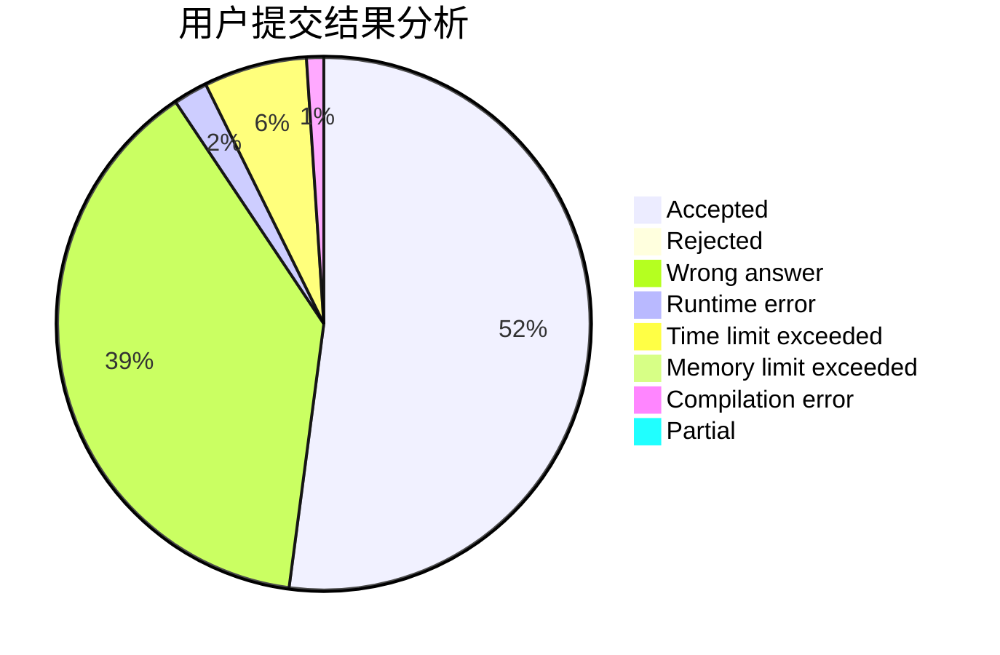
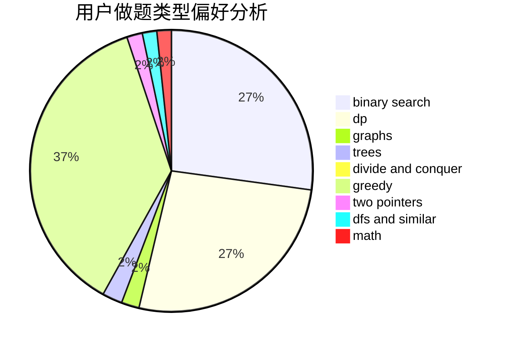

# zhoujun

<!-- tabs:start -->

#### **用户提交结果分析**

#### **用户做题类型偏好分析**

<!-- tabs:end -->
# 推荐题目
[597B](https://codeforces.com/contest/597/problem/B)
[1208D](https://codeforces.com/contest/1208/problem/D)
[611A](https://codeforces.com/contest/611/problem/A)
[1132G](https://codeforces.com/contest/1132/problem/G)
[1114C](https://codeforces.com/contest/1114/problem/C)
[706A](https://codeforces.com/contest/706/problem/A)
[11732](https://codeforces.com/contest/1173/problem/2)
[69E](https://codeforces.com/contest/69/problem/E)
[814A](https://codeforces.com/contest/814/problem/A)
[1234A](https://codeforces.com/contest/1234/problem/A)
