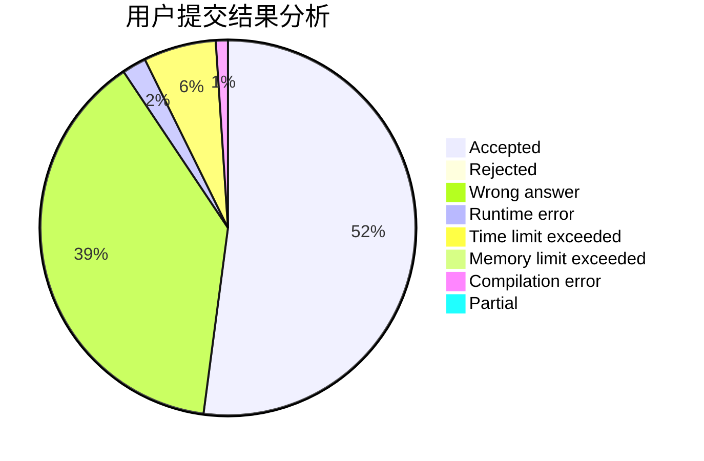
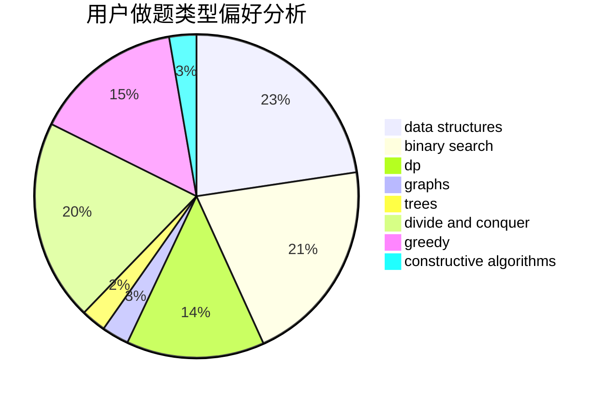
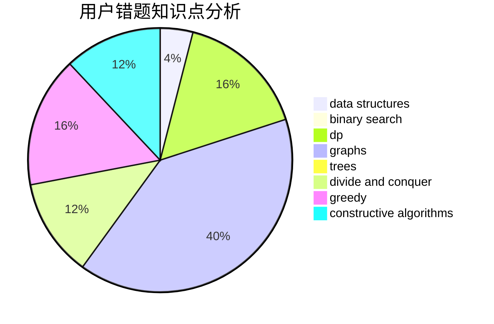

# zhoujun

<!-- tabs:start -->

#### **用户提交结果分析**

#### **用户做题类型偏好分析**

#### **用户错题知识点分析**

<!-- tabs:end -->
# 推荐题目
[575G](https://codeforces.com/contest/575/problem/G)		dfs and similar,
                        shortest paths		  
[1203F1](https://codeforces.com/contest/1203F/problem/1)		greedy		  
[591C](https://codeforces.com/contest/591/problem/C)		dsu,graphs,sortings,trees		  
[1131A](https://codeforces.com/contest/1131/problem/A)		math		  
[1113F](https://codeforces.com/contest/1113/problem/F)		dsu,graphs,sortings,trees		  
[682A](https://codeforces.com/contest/682/problem/A)		constructive algorithms,
                        math,
                        number theory		  
[1168C](https://codeforces.com/contest/1168/problem/C)		bitmasks,
                        dp		  
[675B](https://codeforces.com/contest/675/problem/B)		brute force,
                        constructive algorithms,
                        math		  
[79D](https://codeforces.com/contest/79/problem/D)		bitmasks,
                        dp,
                        shortest paths		  
[1225E](https://codeforces.com/contest/1225/problem/E)		binary search,
                        dp		  
