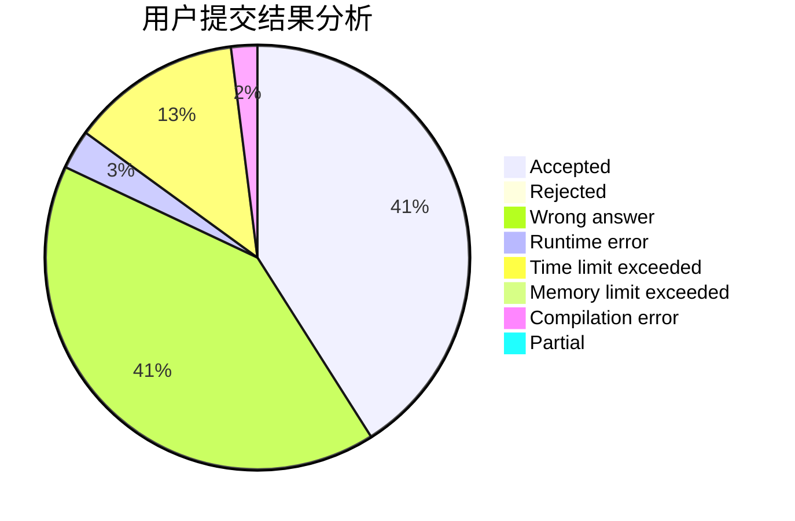
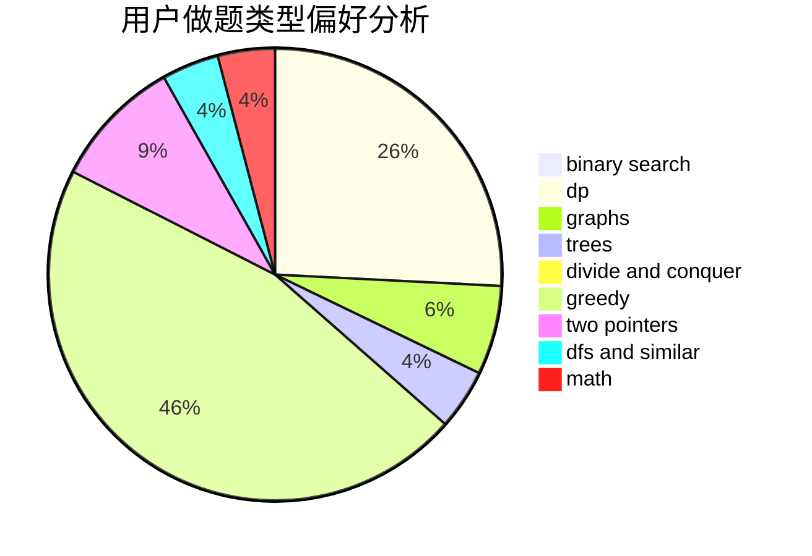

# zhouxiaolun

<!-- tabs:start -->

#### **用户提交结果分析**

#### **用户做题类型偏好分析**

<!-- tabs:end -->
# 推荐题目
[701C](https://codeforces.com/contest/701/problem/C)
[996B](https://codeforces.com/contest/996/problem/B)
[1083F](https://codeforces.com/contest/1083/problem/F)
[851C](https://codeforces.com/contest/851/problem/C)
[794C](https://codeforces.com/contest/794/problem/C)
[1109E](https://codeforces.com/contest/1109/problem/E)
[198E](https://codeforces.com/contest/198/problem/E)
[947E](https://codeforces.com/contest/947/problem/E)
[725A](https://codeforces.com/contest/725/problem/A)
[38A](https://codeforces.com/contest/38/problem/A)
