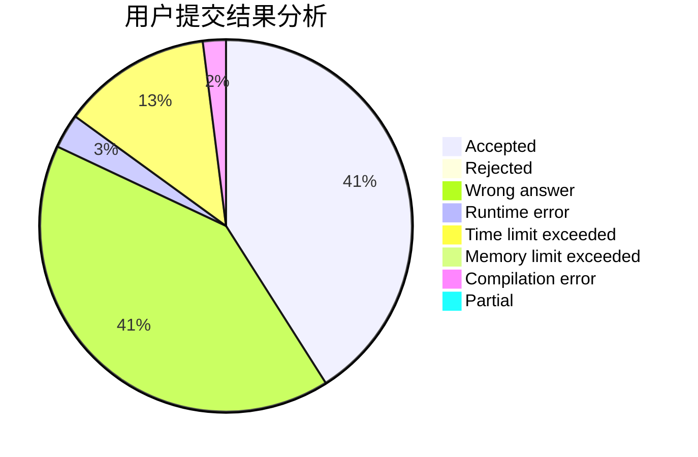
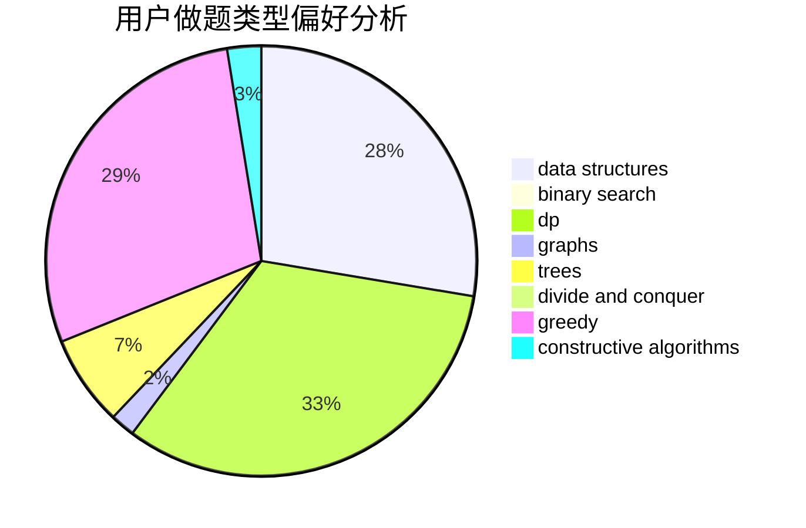
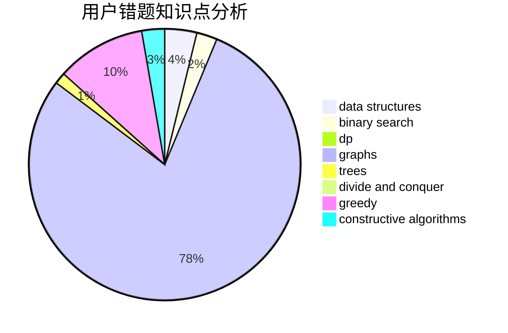

# zhouxiaolun

<!-- tabs:start -->

#### **用户提交结果分析**

#### **用户做题类型偏好分析**

#### **用户错题知识点分析**

<!-- tabs:end -->
# 推荐题目
[701C](https://codeforces.com/contest/701/problem/C)		binary search,
                        strings,
                        two pointers		  
[996B](https://codeforces.com/contest/996/problem/B)		binary search,
                        math		  
[1083F](https://codeforces.com/contest/1083/problem/F)		data structures		  
[851C](https://codeforces.com/contest/851/problem/C)		dsu,graphs,sortings,trees		  
[794C](https://codeforces.com/contest/794/problem/C)		games,
                        greedy,
                        sortings		  
[1109E](https://codeforces.com/contest/1109/problem/E)		data structures,
                        number theory		  
[198E](https://codeforces.com/contest/198/problem/E)		binary search,
                        data structures,
                        sortings		  
[947E](https://codeforces.com/contest/947/problem/E)		dsu,graphs,sortings,trees		  
[725A](https://codeforces.com/contest/725/problem/A)		implementation		  
[38A](https://codeforces.com/contest/38/problem/A)		implementation		  
