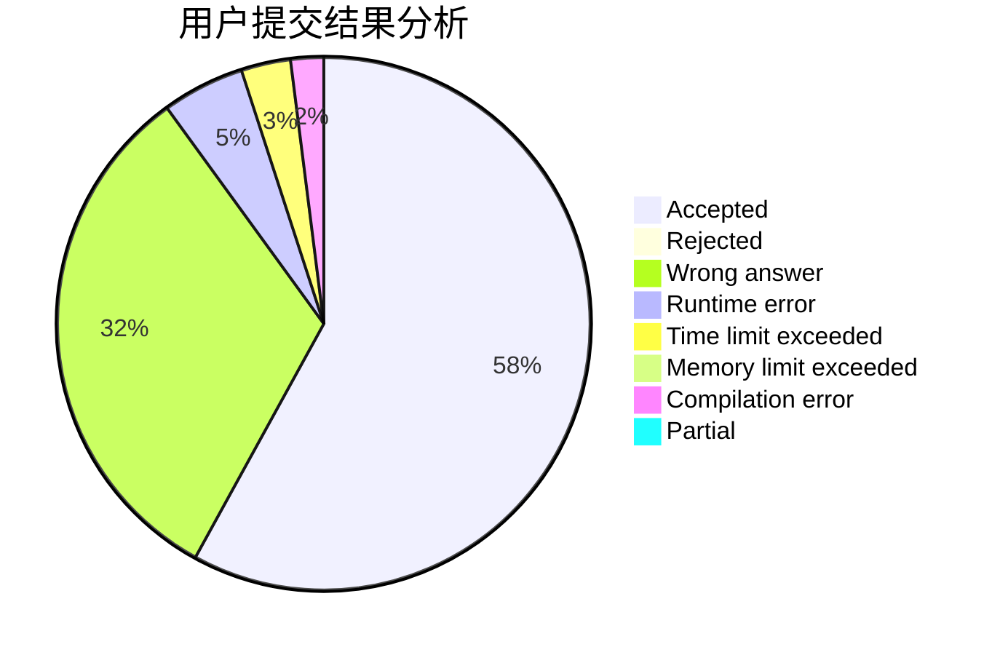
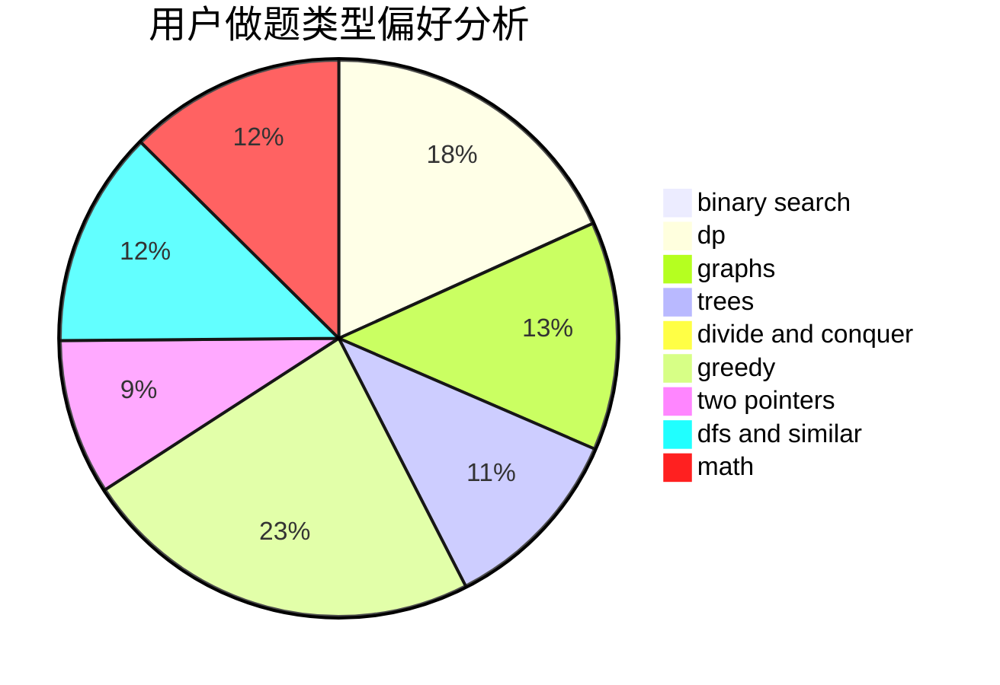

# zhouzhendong

<!-- tabs:start -->

#### **用户提交结果分析**

#### **用户做题类型偏好分析**

<!-- tabs:end -->
# 推荐题目
[370A](https://codeforces.com/contest/370/problem/A)
[114E](https://codeforces.com/contest/114/problem/E)
[164C](https://codeforces.com/contest/164/problem/C)
[802L](https://codeforces.com/contest/802/problem/L)
[280B](https://codeforces.com/contest/280/problem/B)
[353E](https://codeforces.com/contest/353/problem/E)
[1149E](https://codeforces.com/contest/1149/problem/E)
[9B](https://codeforces.com/contest/9/problem/B)
[1510F](https://codeforces.com/contest/1510/problem/F)
[337D](https://codeforces.com/contest/337/problem/D)
