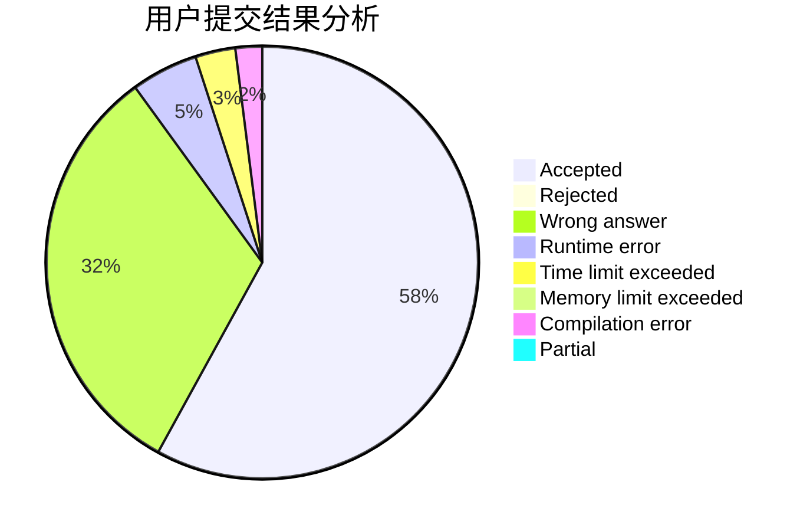
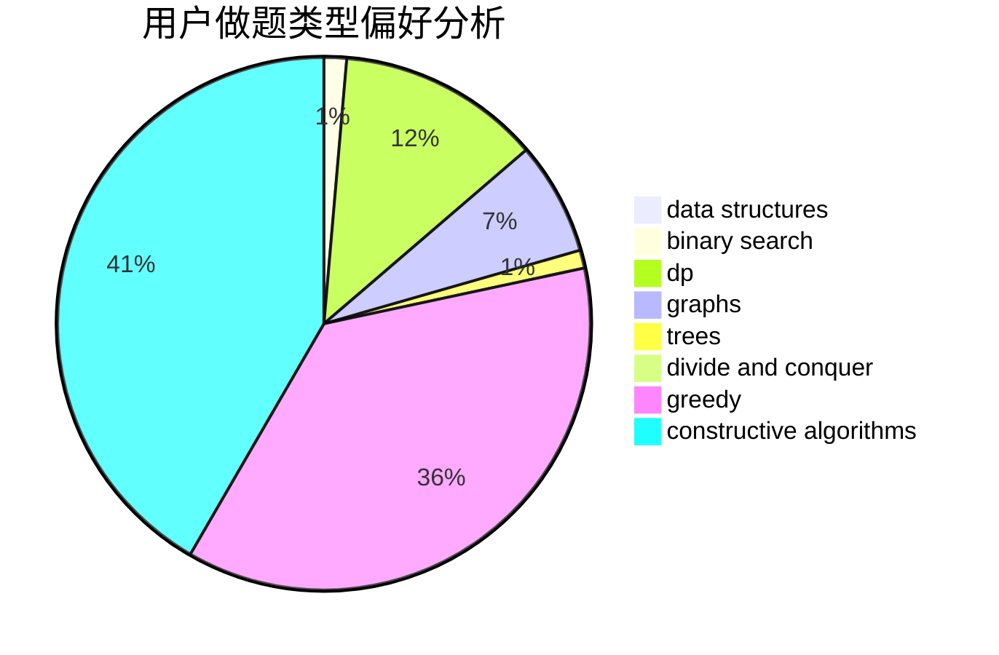
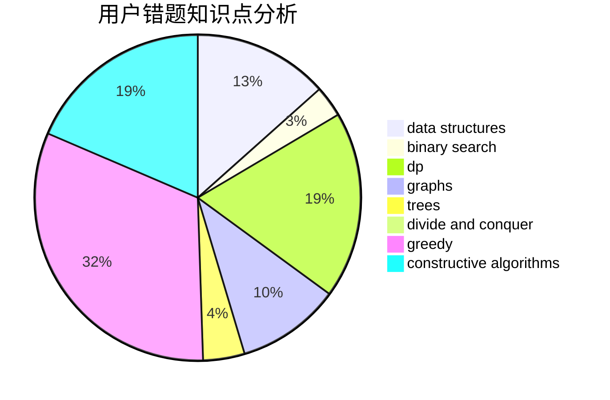

# zhouzhendong

<!-- tabs:start -->

#### **用户提交结果分析**

#### **用户做题类型偏好分析**

#### **用户错题知识点分析**

<!-- tabs:end -->
# 推荐题目
[343E](https://codeforces.com/contest/343/problem/E)		brute force,
                        dfs and similar,
                        divide and conquer,
                        flows,
                        graphs,
                        greedy,
                        trees		  
[1148E](https://codeforces.com/contest/1148/problem/E)		constructive algorithms,
                        greedy,
                        math,
                        sortings,
                        two pointers		  
[1510D](https://codeforces.com/contest/1510/problem/D)		dp,
                        math,
                        number theory		  
[786B](https://codeforces.com/contest/786/problem/B)		data structures,
                        graphs,
                        shortest paths		  
[264B](https://codeforces.com/contest/264/problem/B)		dp,
                        number theory		  
[323B](https://codeforces.com/contest/323/problem/B)		constructive algorithms,
                        graphs		  
[1147F](https://codeforces.com/contest/1147/problem/F)		games,
                        interactive		  
[985B](https://codeforces.com/contest/985/problem/B)		implementation		  
[14E](https://codeforces.com/contest/14/problem/E)		dp		  
[313D](https://codeforces.com/contest/313/problem/D)		dp		  
