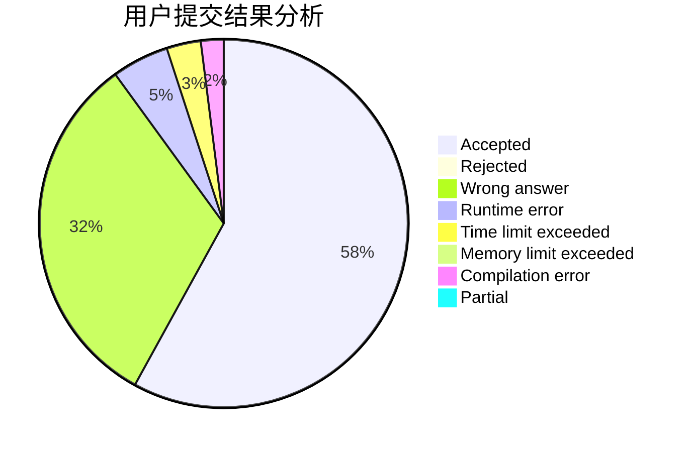
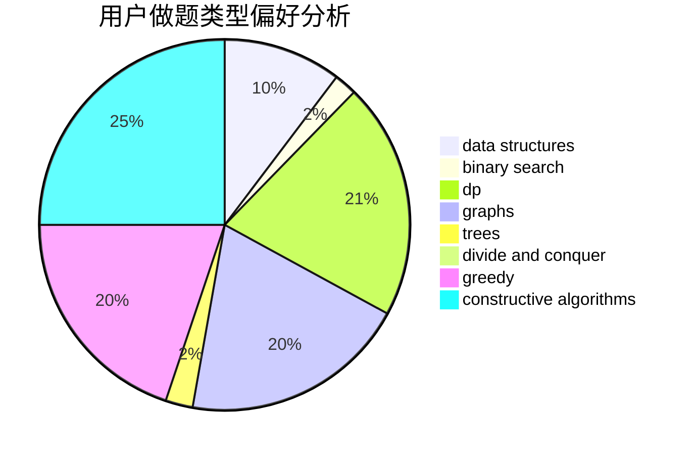
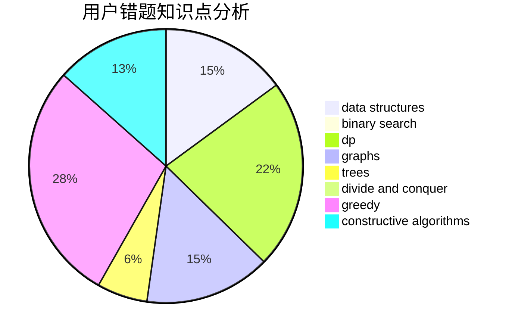

# zhouzhendong

<!-- tabs:start -->

#### **用户提交结果分析**

#### **用户做题类型偏好分析**

#### **用户错题知识点分析**

<!-- tabs:end -->
# 推荐题目
[370A](https://codeforces.com/contest/370/problem/A)		graphs,
                        math,
                        shortest paths		  
[114E](https://codeforces.com/contest/114/problem/E)		dsu,graphs,sortings,trees		  
[164C](https://codeforces.com/contest/164/problem/C)		flows,
                        graphs		  
[802L](https://codeforces.com/contest/802/problem/L)		dfs and similar,
                        dp,
                        math,
                        trees		  
[280B](https://codeforces.com/contest/280/problem/B)		data structures,
                        implementation,
                        two pointers		  
[353E](https://codeforces.com/contest/353/problem/E)		dp,
                        graph matchings,
                        greedy		  
[1149E](https://codeforces.com/contest/1149/problem/E)		games,
                        graphs		  
[9B](https://codeforces.com/contest/9/problem/B)		brute force,
                        geometry,
                        implementation		  
[1510F](https://codeforces.com/contest/1510/problem/F)		nan		  
[337D](https://codeforces.com/contest/337/problem/D)		dfs and similar,
                        divide and conquer,
                        dp,
                        trees		  
