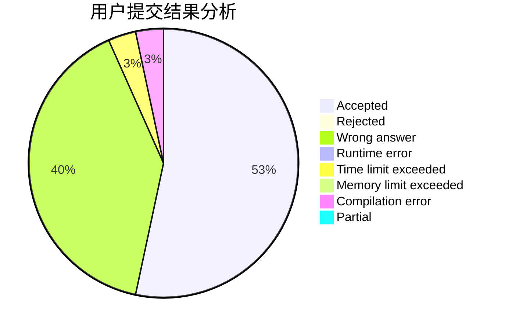
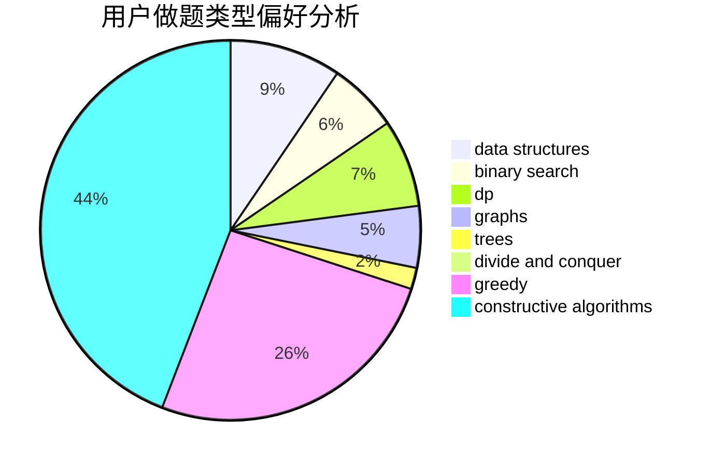
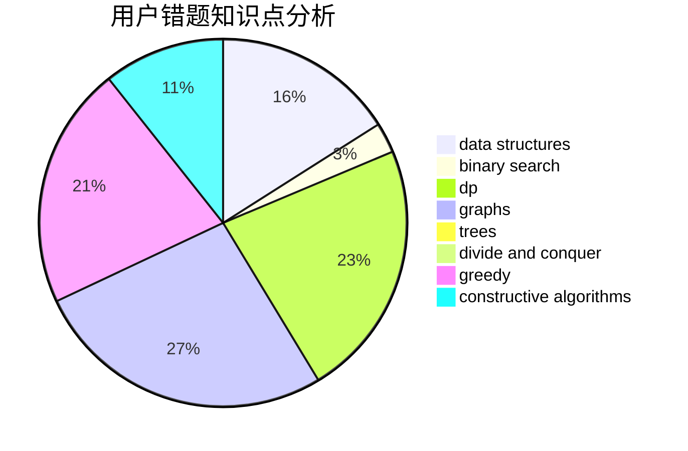

# zhouziheng2

<!-- tabs:start -->

#### **用户提交结果分析**

#### **用户做题类型偏好分析**

#### **用户错题知识点分析**

<!-- tabs:end -->
# 推荐题目
[1509D](https://codeforces.com/contest/1509/problem/D)		dsu,graphs,sortings,trees		  
[14621](https://codeforces.com/contest/1462/problem/1)		dsu,graphs,sortings,trees		  
[868D](https://codeforces.com/contest/868/problem/D)		bitmasks,
                        brute force,
                        dp,
                        implementation,
                        strings		  
[219D](https://codeforces.com/contest/219/problem/D)		dfs and similar,
                        dp,
                        graphs,
                        trees		  
[735A](https://codeforces.com/contest/735/problem/A)		implementation,
                        strings		  
[1023C](https://codeforces.com/contest/1023/problem/C)		greedy		  
[567A](https://codeforces.com/contest/567/problem/A)		greedy,
                        implementation		  
[1310B](https://codeforces.com/contest/1310/problem/B)		dp,
                        implementation		  
[518B](https://codeforces.com/contest/518/problem/B)		greedy,
                        implementation,
                        strings		  
[877B](https://codeforces.com/contest/877/problem/B)		brute force,
                        dp		  
