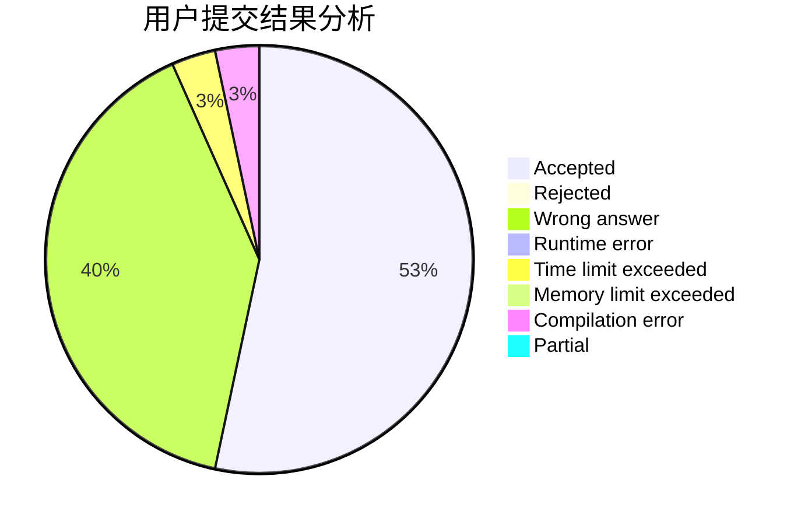
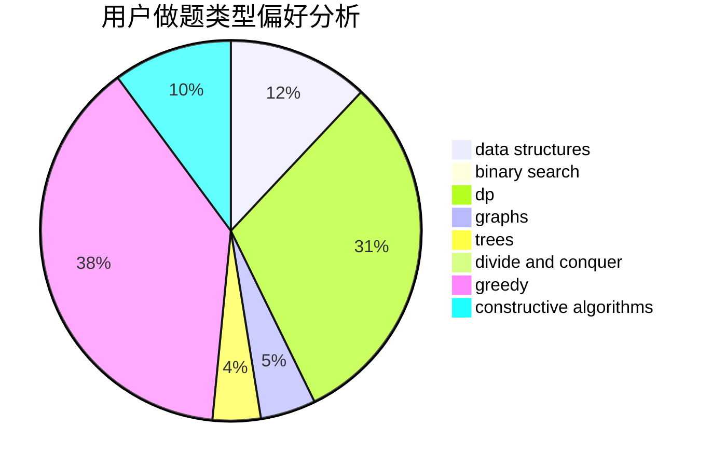
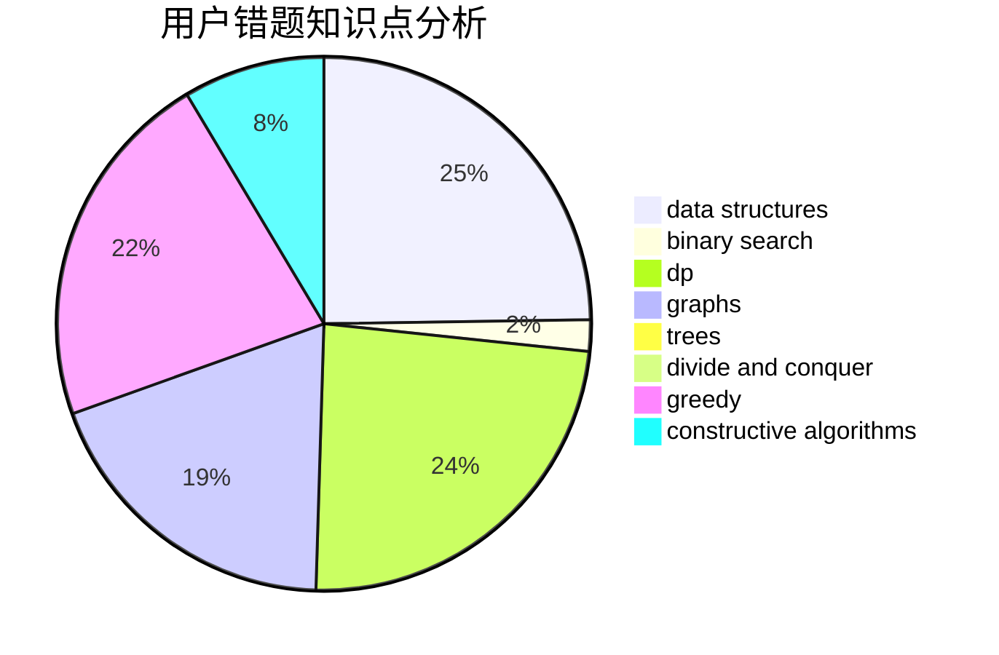

# zhouziheng2

<!-- tabs:start -->

#### **用户提交结果分析**

#### **用户做题类型偏好分析**

#### **用户错题知识点分析**

<!-- tabs:end -->
# 推荐题目
[1499D](https://codeforces.com/contest/1499/problem/D)		dp,
                        math,
                        number theory		  
[1452D](https://codeforces.com/contest/1452/problem/D)		combinatorics,
                        dp,
                        math		  
[849B](https://codeforces.com/contest/849/problem/B)		brute force,
                        geometry		  
[198B](https://codeforces.com/contest/198/problem/B)		shortest paths		  
[717E](https://codeforces.com/contest/717/problem/E)		dfs and similar		  
[1020E](https://codeforces.com/contest/1020/problem/E)		dsu,graphs,sortings,trees		  
[542E](https://codeforces.com/contest/542/problem/E)		graphs,
                        shortest paths		  
[1300D](https://codeforces.com/contest/1300/problem/D)		dsu,graphs,sortings,trees		  
[497E](https://codeforces.com/contest/497/problem/E)		dp,
                        matrices		  
[859E](https://codeforces.com/contest/859/problem/E)		combinatorics,
                        dfs and similar,
                        dsu,
                        graphs,
                        trees		  
