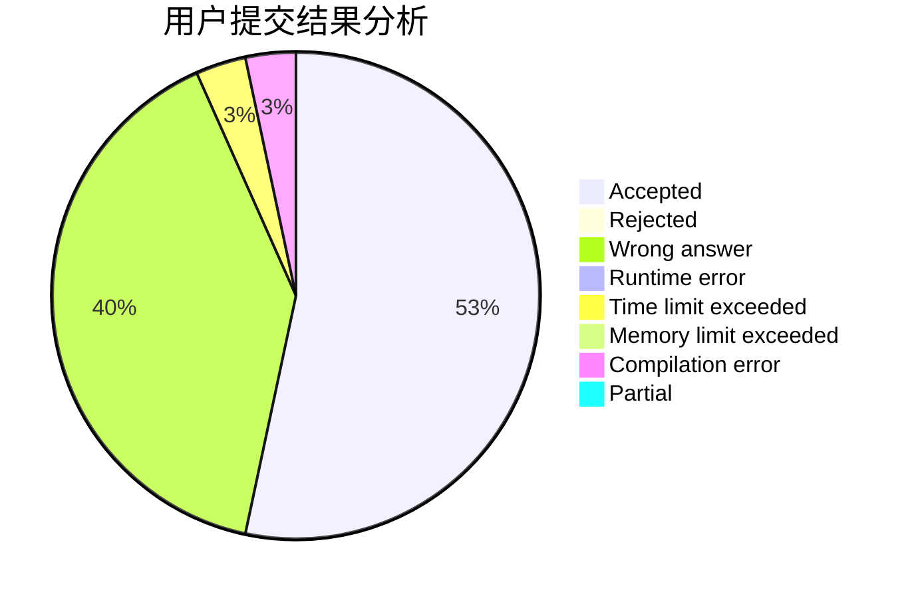
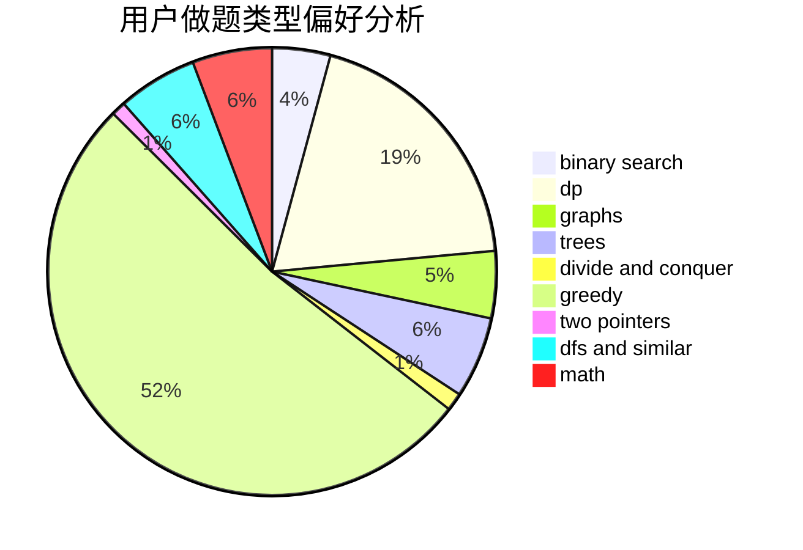

# zhouziheng2

<!-- tabs:start -->

#### **用户提交结果分析**

#### **用户做题类型偏好分析**

<!-- tabs:end -->
# 推荐题目
[1509D](https://codeforces.com/contest/1509/problem/D)
[14621](https://codeforces.com/contest/1462/problem/1)
[868D](https://codeforces.com/contest/868/problem/D)
[219D](https://codeforces.com/contest/219/problem/D)
[735A](https://codeforces.com/contest/735/problem/A)
[1023C](https://codeforces.com/contest/1023/problem/C)
[567A](https://codeforces.com/contest/567/problem/A)
[1310B](https://codeforces.com/contest/1310/problem/B)
[518B](https://codeforces.com/contest/518/problem/B)
[877B](https://codeforces.com/contest/877/problem/B)
