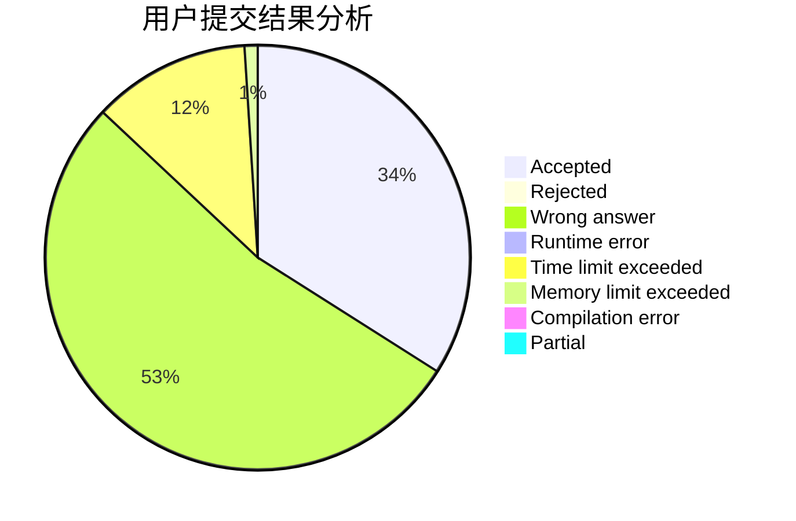
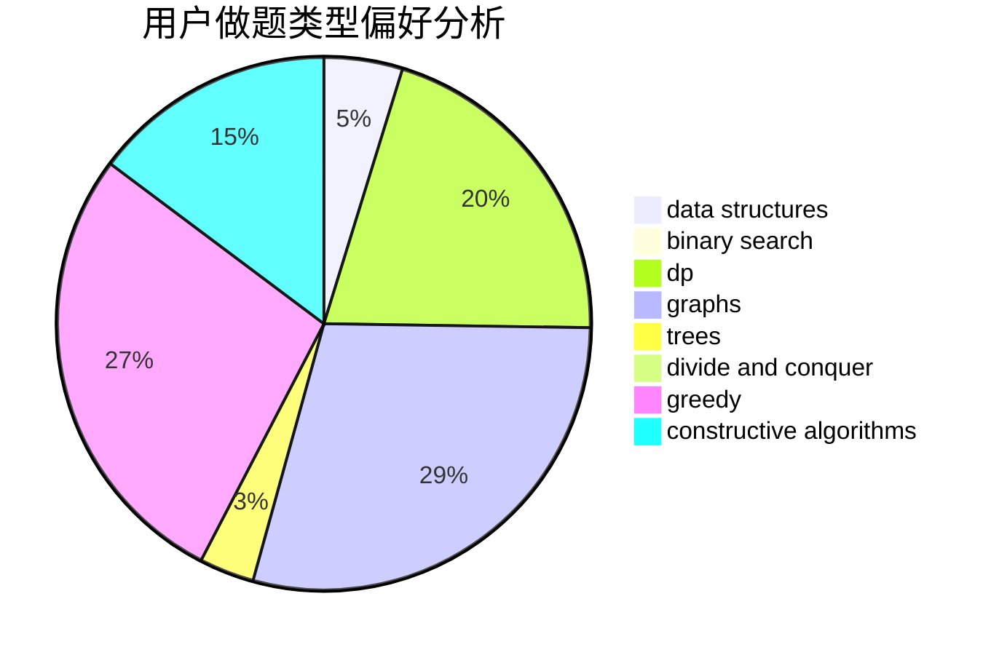
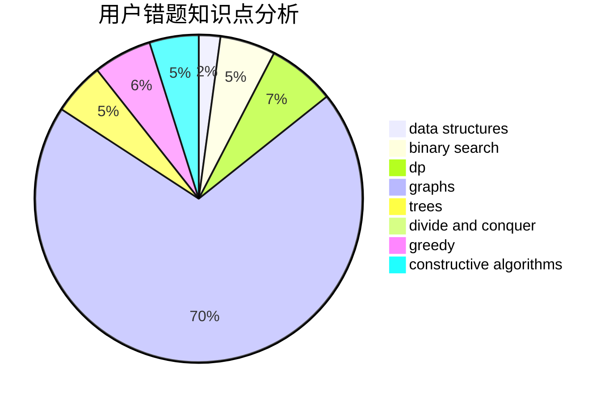

# zhtjtcz

<!-- tabs:start -->

#### **用户提交结果分析**

#### **用户做题类型偏好分析**

#### **用户错题知识点分析**

<!-- tabs:end -->
# 推荐题目
[228D](https://codeforces.com/contest/228/problem/D)		data structures		  
[865D](https://codeforces.com/contest/865/problem/D)		constructive algorithms,
                        data structures,
                        greedy		  
[1207C](https://codeforces.com/contest/1207/problem/C)		dp,
                        greedy		  
[1283A](https://codeforces.com/contest/1283/problem/A)		math		  
[1013B](https://codeforces.com/contest/1013/problem/B)		greedy		  
[367A](https://codeforces.com/contest/367/problem/A)		data structures,
                        implementation		  
[1157D](https://codeforces.com/contest/1157/problem/D)		constructive algorithms,
                        greedy,
                        math		  
[626E](https://codeforces.com/contest/626/problem/E)		binary search,
                        math,
                        ternary search		  
[750B](https://codeforces.com/contest/750/problem/B)		geometry,
                        implementation		  
[1407A](https://codeforces.com/contest/1407/problem/A)		constructive algorithms,
                        math		  
