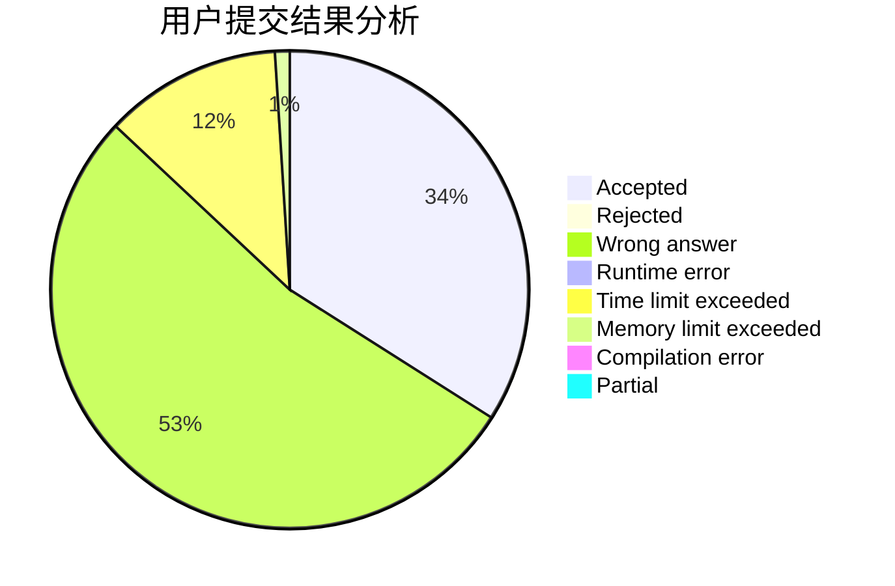
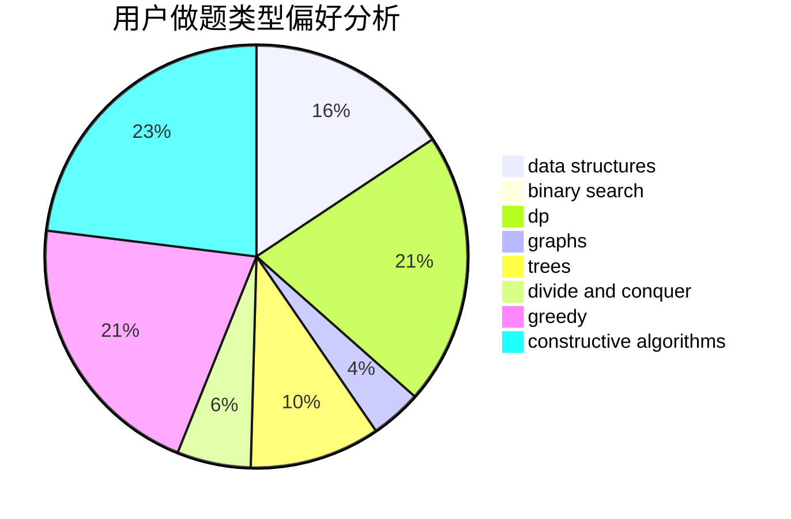
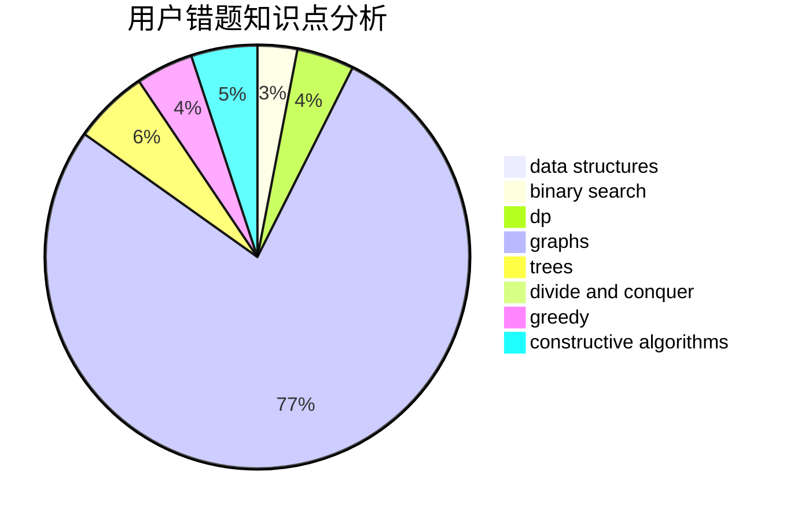

# zhtjtcz

<!-- tabs:start -->

#### **用户提交结果分析**

#### **用户做题类型偏好分析**

#### **用户错题知识点分析**

<!-- tabs:end -->
# 推荐题目
[246D](https://codeforces.com/contest/246/problem/D)		brute force,
                        dfs and similar,
                        graphs		  
[886A](https://codeforces.com/contest/886/problem/A)		brute force		  
[12131](https://codeforces.com/contest/1213/problem/1)		dsu,graphs,sortings,trees		  
[1290A](https://codeforces.com/contest/1290/problem/A)		brute force,
                        data structures,
                        implementation		  
[1013E](https://codeforces.com/contest/1013/problem/E)		dsu,graphs,sortings,trees		  
[397E](https://codeforces.com/contest/397/problem/E)		dsu,graphs,sortings,trees		  
[1159F](https://codeforces.com/contest/1159/problem/F)		dsu,graphs,sortings,trees		  
[652F](https://codeforces.com/contest/652/problem/F)		constructive algorithms,
                        math		  
[76B](https://codeforces.com/contest/76/problem/B)		greedy,
                        two pointers		  
[1417F](https://codeforces.com/contest/1417/problem/F)		dsu,graphs,sortings,trees		  
