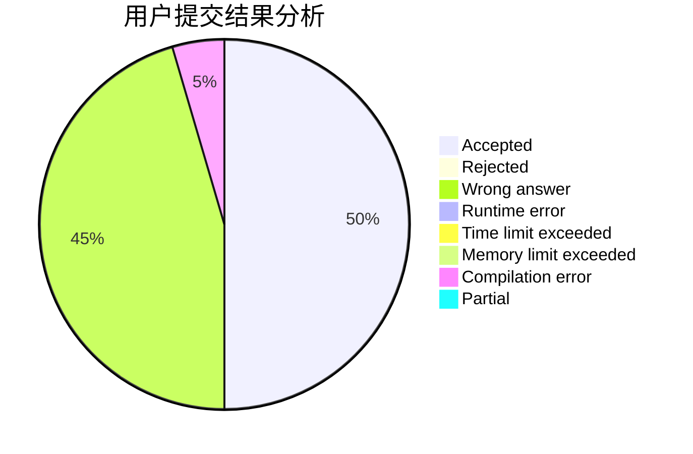
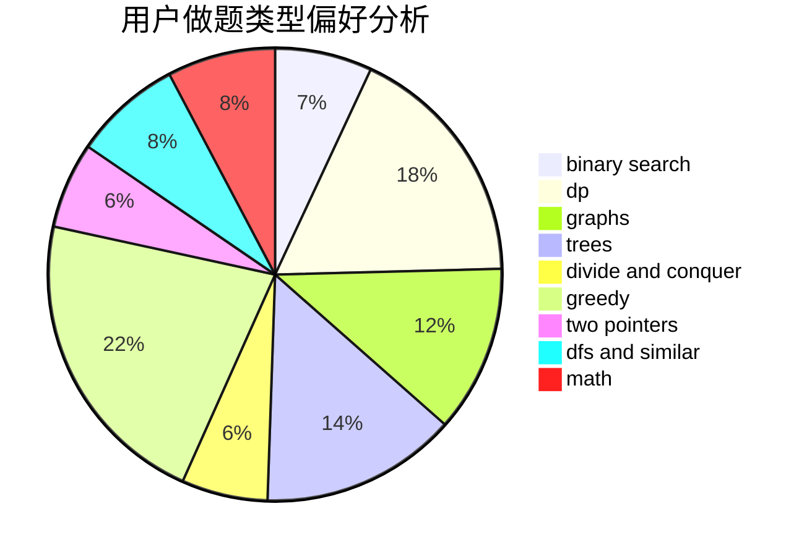

# ChenYiming_NWPU

<!-- tabs:start -->

#### **用户提交结果分析**

#### **用户做题类型偏好分析**

<!-- tabs:end -->
# 推荐题目
[1358D](https://codeforces.com/contest/1358/problem/D)
[581C](https://codeforces.com/contest/581/problem/C)
[107B](https://codeforces.com/contest/107/problem/B)
[377B](https://codeforces.com/contest/377/problem/B)
[701A](https://codeforces.com/contest/701/problem/A)
[246D](https://codeforces.com/contest/246/problem/D)
[1375H](https://codeforces.com/contest/1375/problem/H)
[409G](https://codeforces.com/contest/409/problem/G)
[1186D](https://codeforces.com/contest/1186/problem/D)
[689E](https://codeforces.com/contest/689/problem/E)
