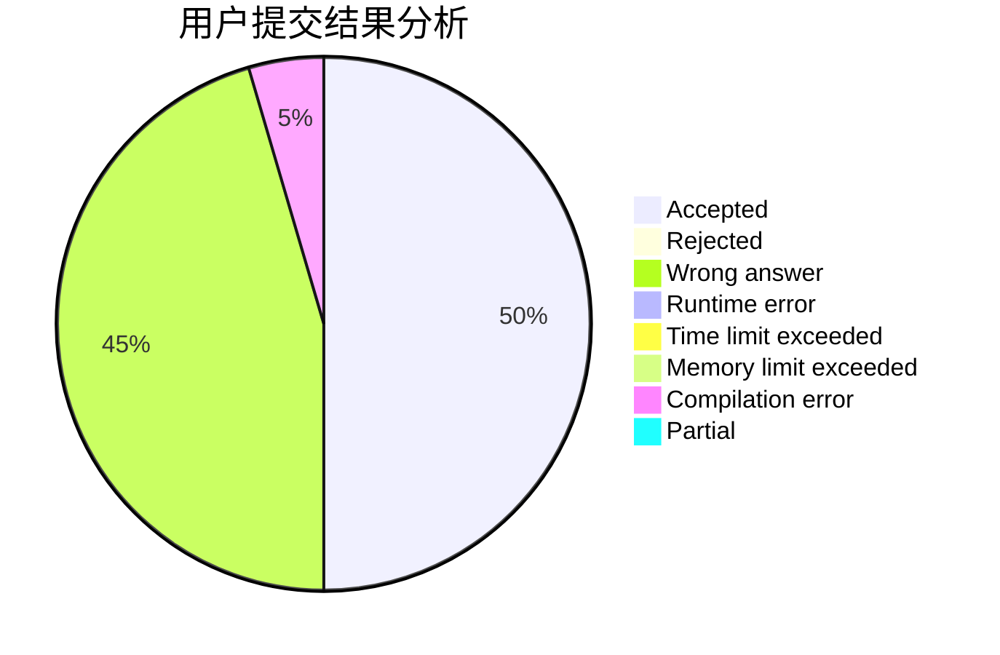
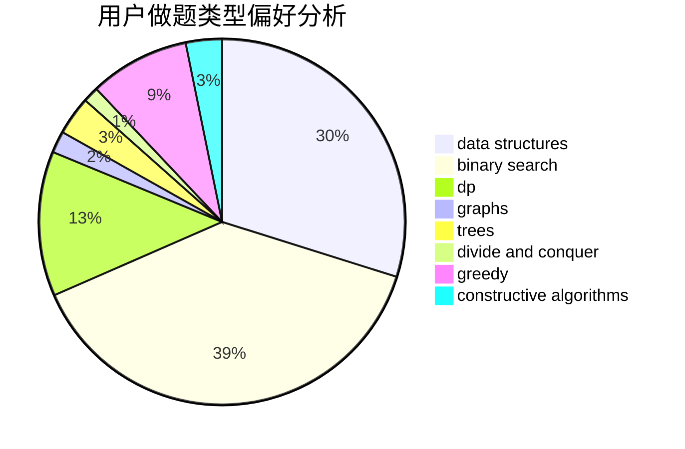
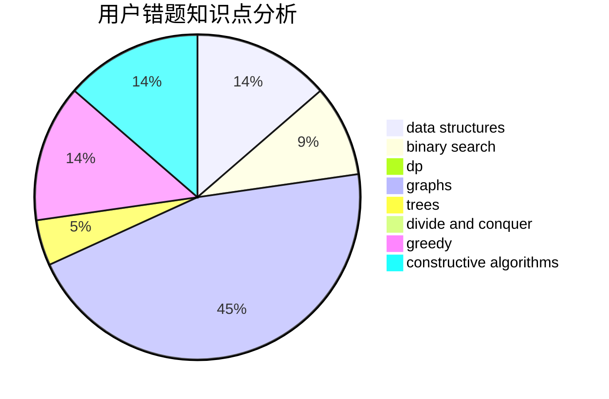

# ChenYiming_NWPU

<!-- tabs:start -->

#### **用户提交结果分析**

#### **用户做题类型偏好分析**

#### **用户错题知识点分析**

<!-- tabs:end -->
# 推荐题目
[1351C](https://codeforces.com/contest/1351/problem/C)		data structures,
                        implementation		  
[558E](https://codeforces.com/contest/558/problem/E)		data structures,
                        sortings,
                        strings		  
[1079C](https://codeforces.com/contest/1079/problem/C)		dsu,graphs,sortings,trees		  
[34D](https://codeforces.com/contest/34/problem/D)		dfs and similar,
                        graphs		  
[677A](https://codeforces.com/contest/677/problem/A)		implementation		  
[228D](https://codeforces.com/contest/228/problem/D)		data structures		  
[1368H2](https://codeforces.com/contest/1368H/problem/2)		nan		  
[37B](https://codeforces.com/contest/37/problem/B)		greedy,
                        implementation		  
[1183F](https://codeforces.com/contest/1183/problem/F)		brute force,
                        math,
                        sortings		  
[667E](https://codeforces.com/contest/667/problem/E)		dsu,graphs,sortings,trees		  
