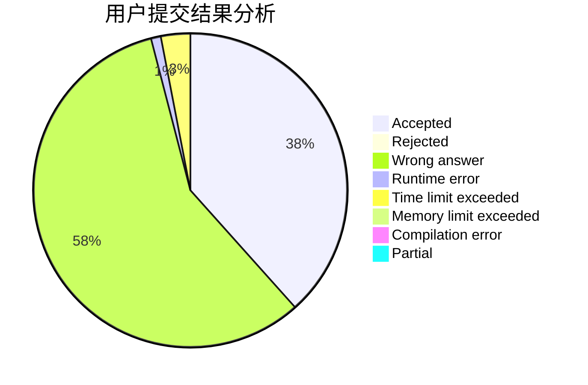
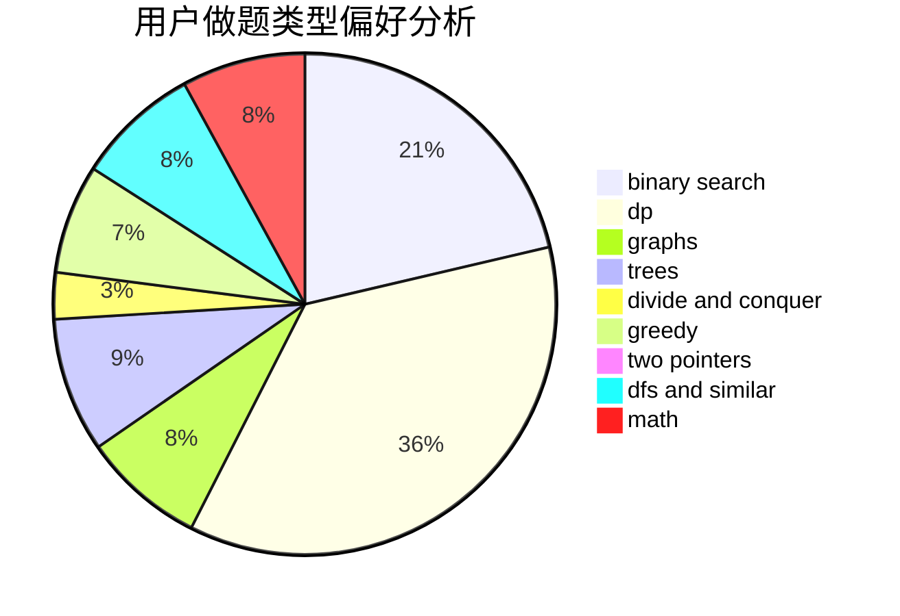

# zhuhuoshan

<!-- tabs:start -->

#### **用户提交结果分析**

#### **用户做题类型偏好分析**

<!-- tabs:end -->
# 推荐题目
[1498C](https://codeforces.com/contest/1498/problem/C)
[833A](https://codeforces.com/contest/833/problem/A)
[1322E](https://codeforces.com/contest/1322/problem/E)
[899A](https://codeforces.com/contest/899/problem/A)
[36B](https://codeforces.com/contest/36/problem/B)
[913G](https://codeforces.com/contest/913/problem/G)
[1053E](https://codeforces.com/contest/1053/problem/E)
[283E](https://codeforces.com/contest/283/problem/E)
[1342C](https://codeforces.com/contest/1342/problem/C)
[417E](https://codeforces.com/contest/417/problem/E)
