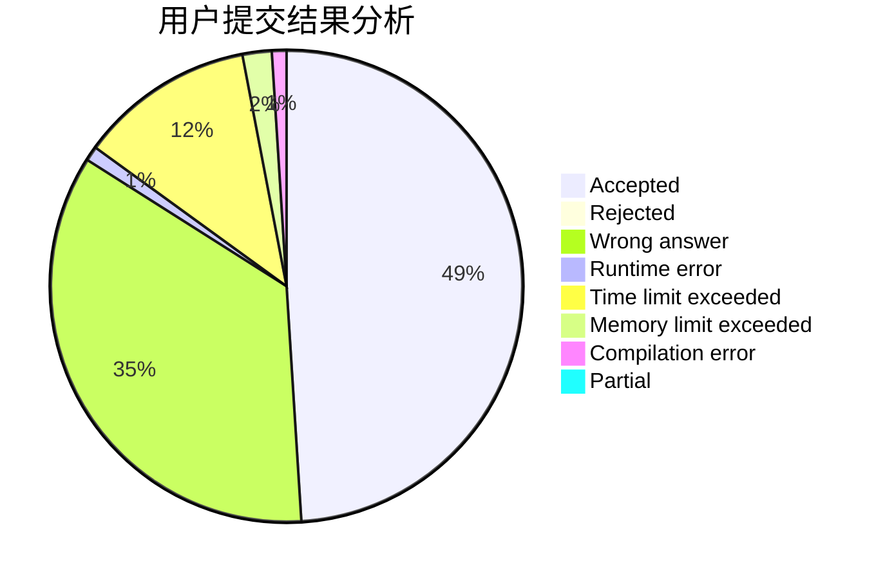
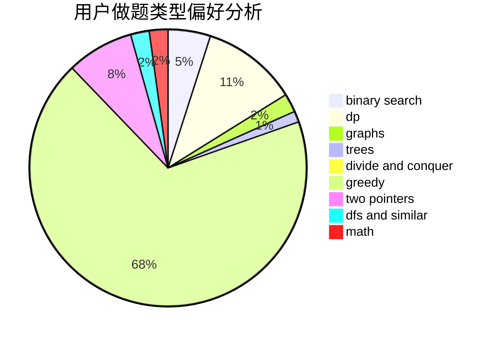

# zhujunchao

<!-- tabs:start -->

#### **用户提交结果分析**

#### **用户做题类型偏好分析**

<!-- tabs:end -->
# 推荐题目
[1435D](https://codeforces.com/contest/1435/problem/D)
[516C](https://codeforces.com/contest/516/problem/C)
[520A](https://codeforces.com/contest/520/problem/A)
[429D](https://codeforces.com/contest/429/problem/D)
[798E](https://codeforces.com/contest/798/problem/E)
[401D](https://codeforces.com/contest/401/problem/D)
[1009E](https://codeforces.com/contest/1009/problem/E)
[1151D](https://codeforces.com/contest/1151/problem/D)
[762A](https://codeforces.com/contest/762/problem/A)
[189B](https://codeforces.com/contest/189/problem/B)
