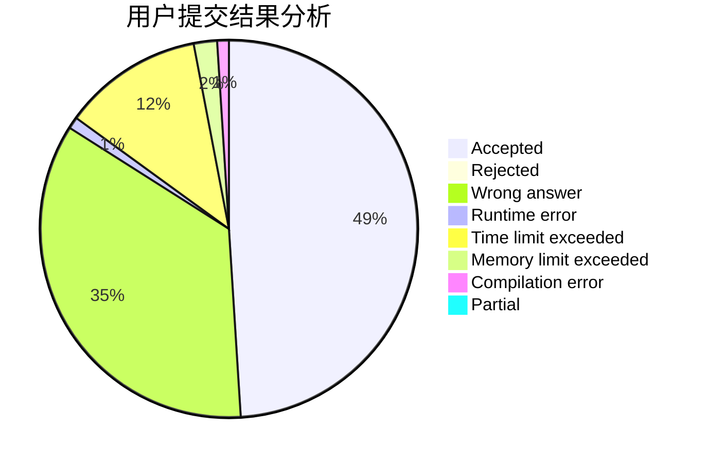
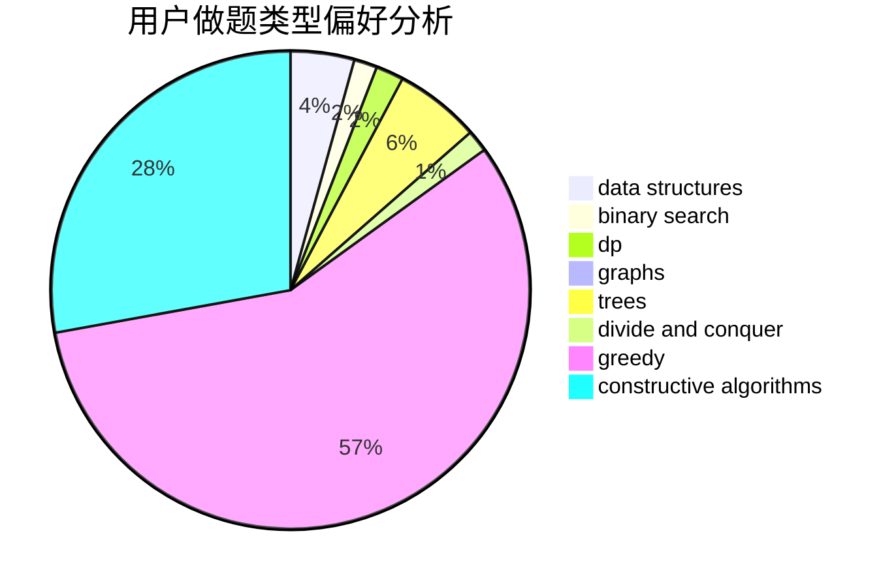
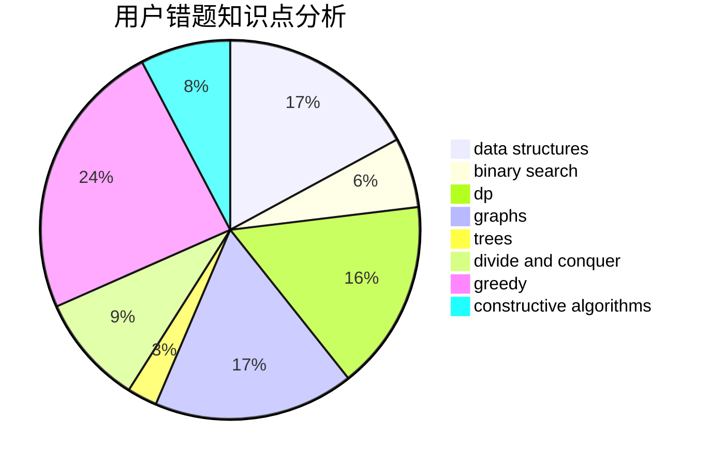

# zhujunchao

<!-- tabs:start -->

#### **用户提交结果分析**

#### **用户做题类型偏好分析**

#### **用户错题知识点分析**

<!-- tabs:end -->
# 推荐题目
[1427A](https://codeforces.com/contest/1427/problem/A)		math,
                        sortings		  
[497B](https://codeforces.com/contest/497/problem/B)		dsu,graphs,sortings,trees		  
[4A](https://codeforces.com/contest/4/problem/A)		brute force,
                        math		  
[3C](https://codeforces.com/contest/3/problem/C)		brute force,
                        games,
                        implementation		  
[780B](https://codeforces.com/contest/780/problem/B)		binary search		  
[371E](https://codeforces.com/contest/371/problem/E)		greedy,
                        math,
                        two pointers		  
[1009B](https://codeforces.com/contest/1009/problem/B)		greedy,
                        implementation		  
[114A](https://codeforces.com/contest/114/problem/A)		math		  
[741A](https://codeforces.com/contest/741/problem/A)		dfs and similar,
                        math		  
[163D](https://codeforces.com/contest/163/problem/D)		brute force		  
