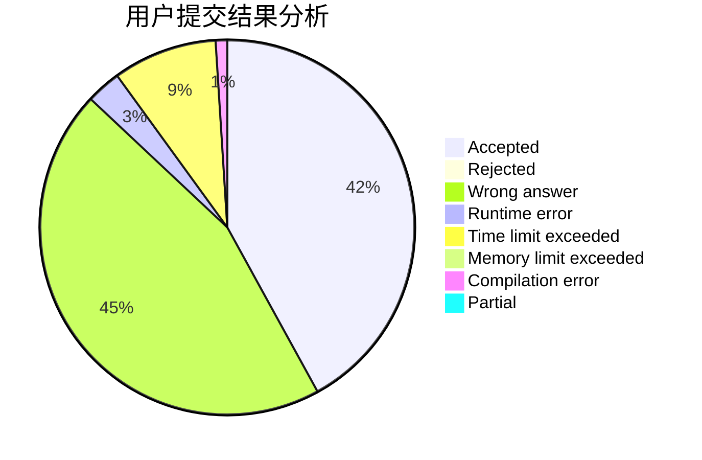
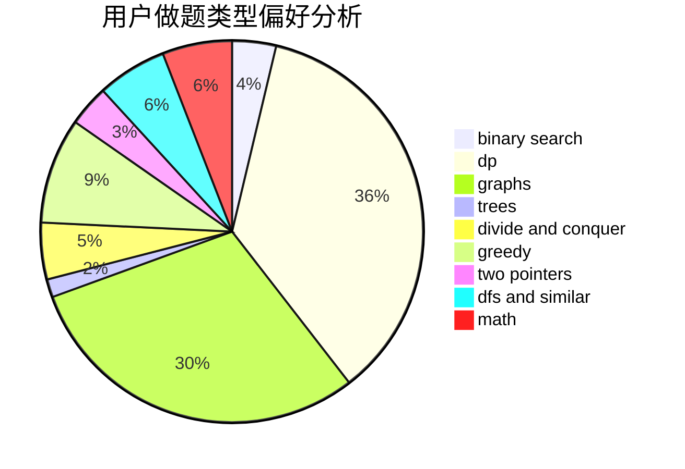

# zhuolang0

<!-- tabs:start -->

#### **用户提交结果分析**

#### **用户做题类型偏好分析**

<!-- tabs:end -->
# 推荐题目
[1011C](https://codeforces.com/contest/1011/problem/C)
[1215A](https://codeforces.com/contest/1215/problem/A)
[11843](https://codeforces.com/contest/1184/problem/3)
[913A](https://codeforces.com/contest/913/problem/A)
[1058E](https://codeforces.com/contest/1058/problem/E)
[796C](https://codeforces.com/contest/796/problem/C)
[1434E](https://codeforces.com/contest/1434/problem/E)
[1380G](https://codeforces.com/contest/1380/problem/G)
[608C](https://codeforces.com/contest/608/problem/C)
[830D](https://codeforces.com/contest/830/problem/D)
