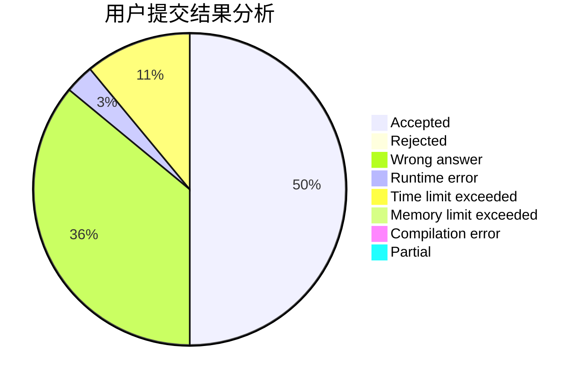
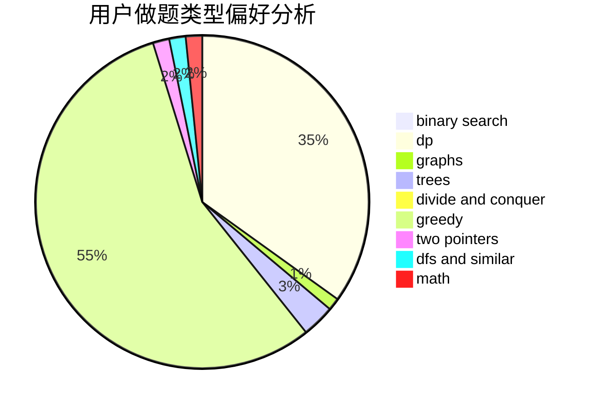

# zhuoyun

<!-- tabs:start -->

#### **用户提交结果分析**

#### **用户做题类型偏好分析**

<!-- tabs:end -->
# 推荐题目
[901A](https://codeforces.com/contest/901/problem/A)
[426B](https://codeforces.com/contest/426/problem/B)
[1070E](https://codeforces.com/contest/1070/problem/E)
[29A](https://codeforces.com/contest/29/problem/A)
[1246D](https://codeforces.com/contest/1246/problem/D)
[1385F](https://codeforces.com/contest/1385/problem/F)
[1210C](https://codeforces.com/contest/1210/problem/C)
[1464D](https://codeforces.com/contest/1464/problem/D)
[1229D](https://codeforces.com/contest/1229/problem/D)
[918C](https://codeforces.com/contest/918/problem/C)
