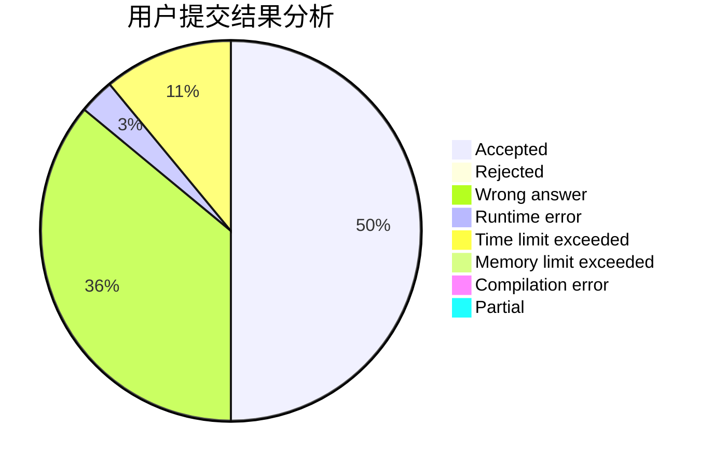
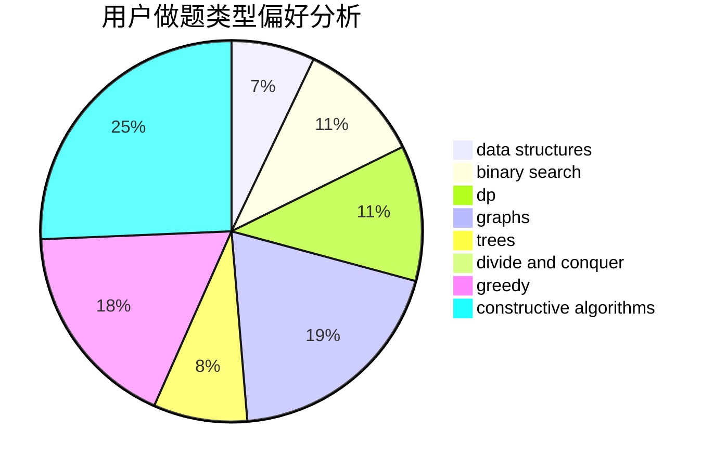
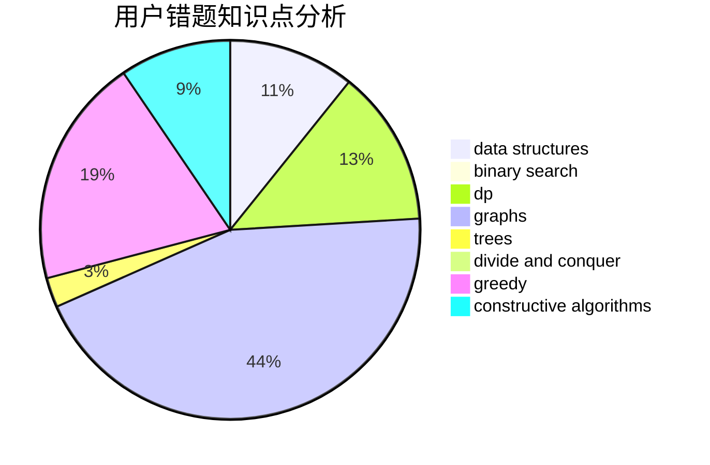

# zhuoyun

<!-- tabs:start -->

#### **用户提交结果分析**

#### **用户做题类型偏好分析**

#### **用户错题知识点分析**

<!-- tabs:end -->
# 推荐题目
[883G](https://codeforces.com/contest/883/problem/G)		dfs and similar,
                        graphs		  
[39D](https://codeforces.com/contest/39/problem/D)		math		  
[1070B](https://codeforces.com/contest/1070/problem/B)		data structures,
                        greedy		  
[283A](https://codeforces.com/contest/283/problem/A)		constructive algorithms,
                        data structures,
                        implementation		  
[1241A](https://codeforces.com/contest/1241/problem/A)		dsu,graphs,sortings,trees		  
[1376B2](https://codeforces.com/contest/1376B/problem/2)		dsu,graphs,sortings,trees		  
[1206B](https://codeforces.com/contest/1206/problem/B)		dp,
                        implementation		  
[1455A](https://codeforces.com/contest/1455/problem/A)		math,
                        number theory		  
[1221C](https://codeforces.com/contest/1221/problem/C)		binary search,
                        math		  
[902A](https://codeforces.com/contest/902/problem/A)		greedy,
                        implementation		  
