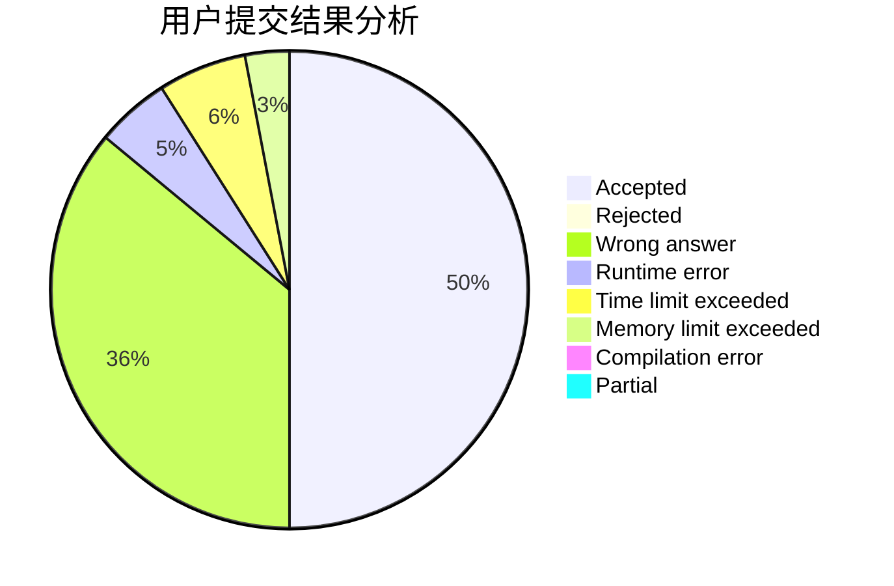
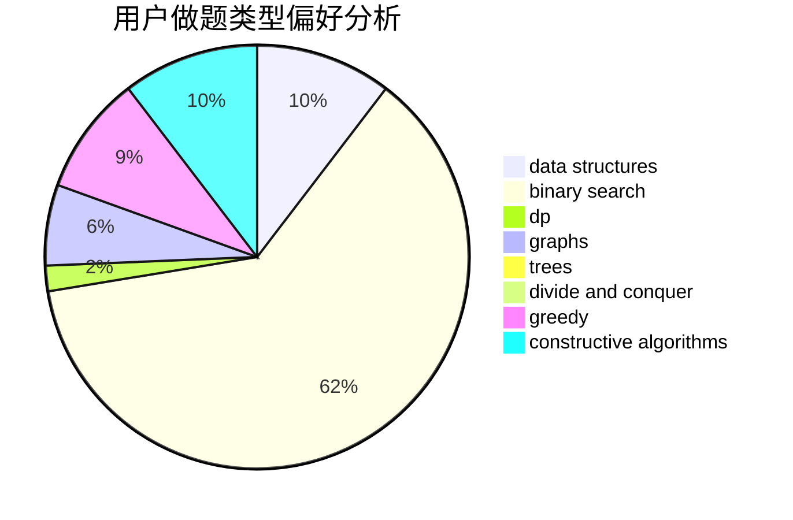
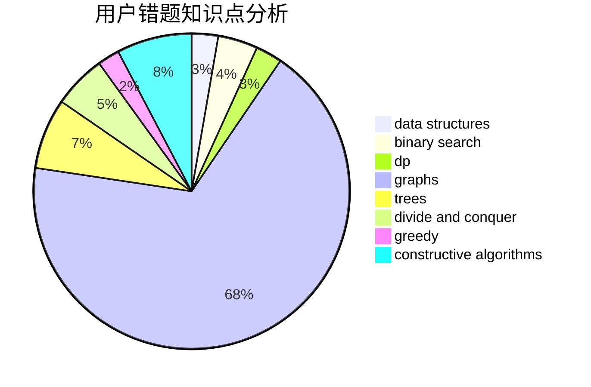

# zhupeijun

<!-- tabs:start -->

#### **用户提交结果分析**

#### **用户做题类型偏好分析**

#### **用户错题知识点分析**

<!-- tabs:end -->
# 推荐题目
[1312E](https://codeforces.com/contest/1312/problem/E)		dp,
                        greedy		  
[653C](https://codeforces.com/contest/653/problem/C)		brute force,
                        implementation		  
[39C](https://codeforces.com/contest/39/problem/C)		dp,
                        sortings		  
[102B](https://codeforces.com/contest/102/problem/B)		implementation		  
[962B](https://codeforces.com/contest/962/problem/B)		constructive algorithms,
                        greedy,
                        implementation		  
[315A](https://codeforces.com/contest/315/problem/A)		brute force		  
[1388E](https://codeforces.com/contest/1388/problem/E)		data structures,
                        geometry,
                        sortings		  
[631D](https://codeforces.com/contest/631/problem/D)		data structures,
                        hashing,
                        implementation,
                        string suffix structures,
                        strings		  
[1051D](https://codeforces.com/contest/1051/problem/D)		bitmasks,
                        dp		  
[1365B](https://codeforces.com/contest/1365/problem/B)		constructive algorithms,
                        implementation		  
