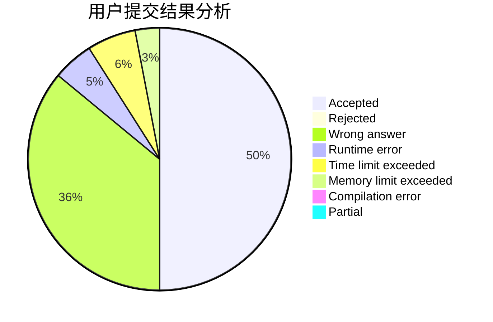
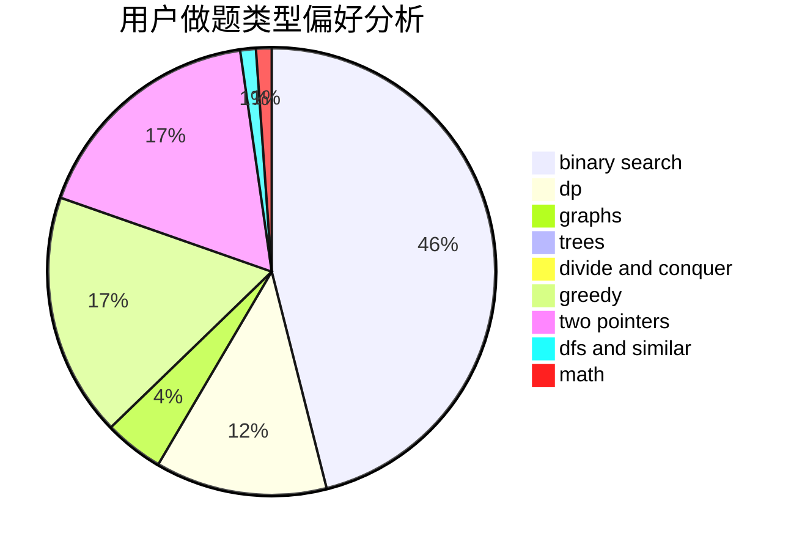

# zhupeijun

<!-- tabs:start -->

#### **用户提交结果分析**

#### **用户做题类型偏好分析**

<!-- tabs:end -->
# 推荐题目
[1312E](https://codeforces.com/contest/1312/problem/E)
[653C](https://codeforces.com/contest/653/problem/C)
[39C](https://codeforces.com/contest/39/problem/C)
[102B](https://codeforces.com/contest/102/problem/B)
[962B](https://codeforces.com/contest/962/problem/B)
[315A](https://codeforces.com/contest/315/problem/A)
[1388E](https://codeforces.com/contest/1388/problem/E)
[631D](https://codeforces.com/contest/631/problem/D)
[1051D](https://codeforces.com/contest/1051/problem/D)
[1365B](https://codeforces.com/contest/1365/problem/B)
