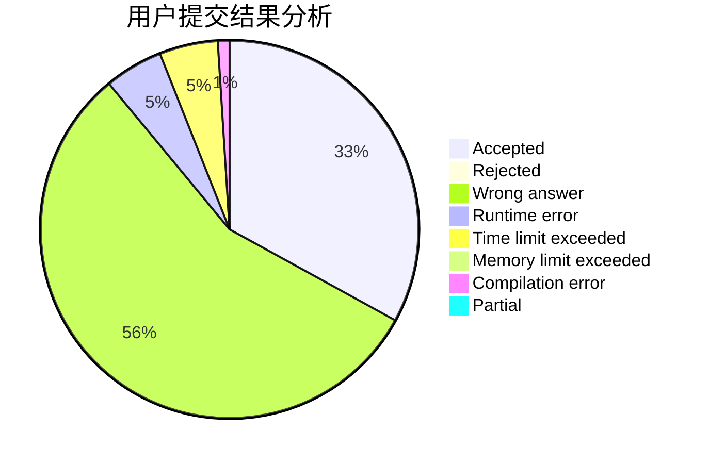
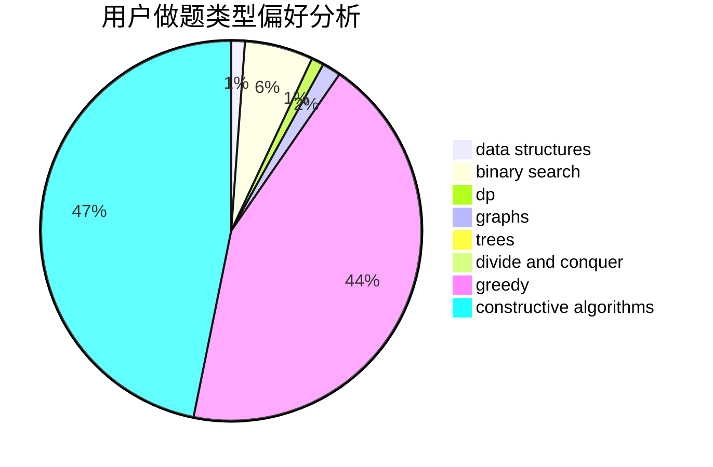

# zhuyou_y

<!-- tabs:start -->

#### **用户提交结果分析**

#### **用户做题类型偏好分析**

#### **用户错题知识点分析**

<!-- tabs:end -->
# 推荐题目
[1329B](https://codeforces.com/contest/1329/problem/B)		bitmasks,
                        combinatorics,
                        math		  
[620B](https://codeforces.com/contest/620/problem/B)		implementation		  
[877C](https://codeforces.com/contest/877/problem/C)		constructive algorithms		  
[976A](https://codeforces.com/contest/976/problem/A)		implementation		  
[572A](https://codeforces.com/contest/572/problem/A)		sortings		  
[784G](https://codeforces.com/contest/784/problem/G)		*special problem		  
[429D](https://codeforces.com/contest/429/problem/D)		data structures,
                        divide and conquer,
                        geometry		  
[1012F](https://codeforces.com/contest/1012/problem/F)		dp,
                        implementation		  
[963A](https://codeforces.com/contest/963/problem/A)		math,
                        number theory		  
[915C](https://codeforces.com/contest/915/problem/C)		dp,
                        greedy		  
