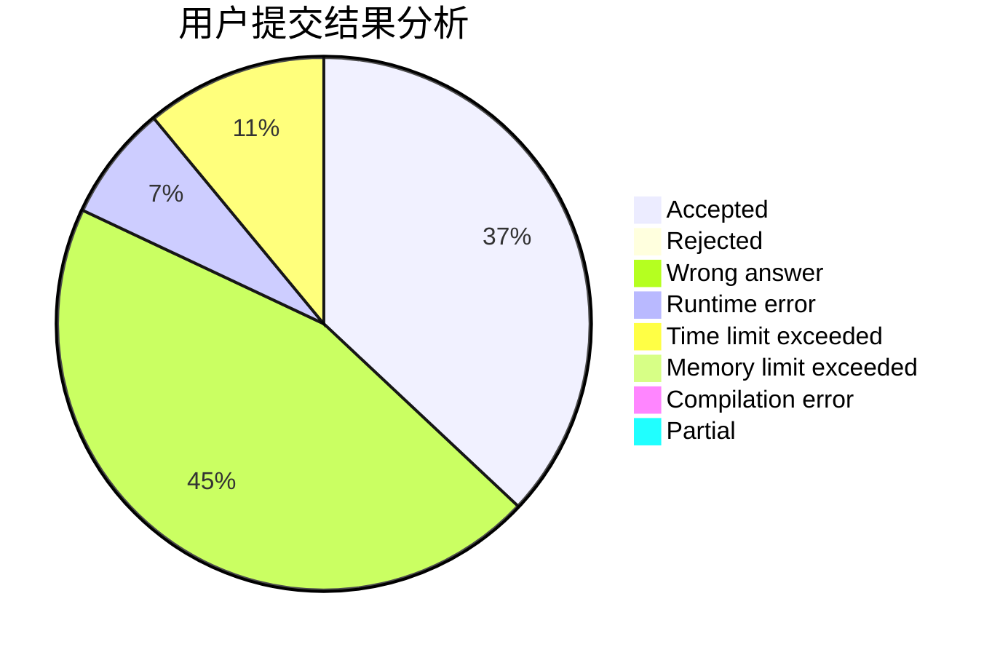
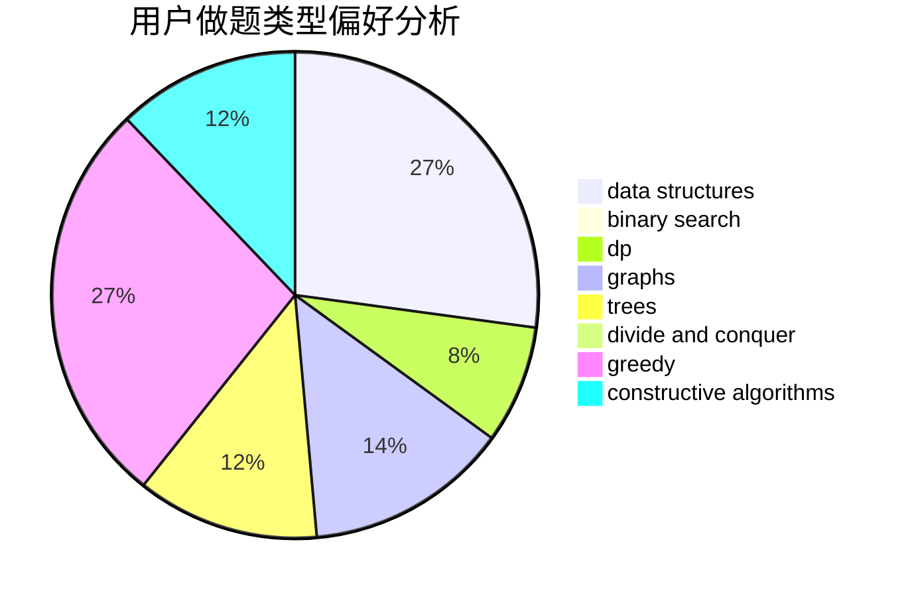
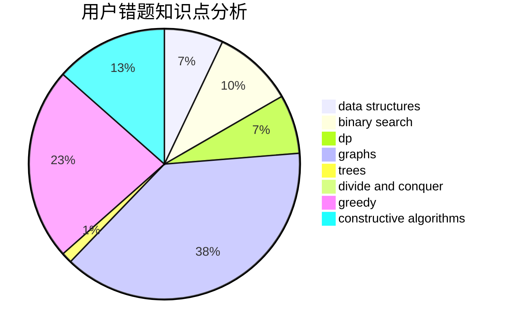

# zhuzhirui2005

<!-- tabs:start -->

#### **用户提交结果分析**

#### **用户做题类型偏好分析**

#### **用户错题知识点分析**

<!-- tabs:end -->
# 推荐题目
[77E](https://codeforces.com/contest/77/problem/E)		geometry		  
[1183A](https://codeforces.com/contest/1183/problem/A)		implementation		  
[364C](https://codeforces.com/contest/364/problem/C)		brute force,
                        number theory		  
[232B](https://codeforces.com/contest/232/problem/B)		bitmasks,
                        combinatorics,
                        dp,
                        math		  
[1334F](https://codeforces.com/contest/1334/problem/F)		binary search,
                        data structures,
                        dp,
                        greedy		  
[723C](https://codeforces.com/contest/723/problem/C)		greedy		  
[1257C](https://codeforces.com/contest/1257/problem/C)		greedy,
                        implementation,
                        sortings,
                        strings,
                        two pointers		  
[1172C2](https://codeforces.com/contest/1172C/problem/2)		dp,
                        probabilities		  
[831A](https://codeforces.com/contest/831/problem/A)		implementation		  
[1423B](https://codeforces.com/contest/1423/problem/B)		binary search,
                        flows,
                        graph matchings,
                        graphs		  
