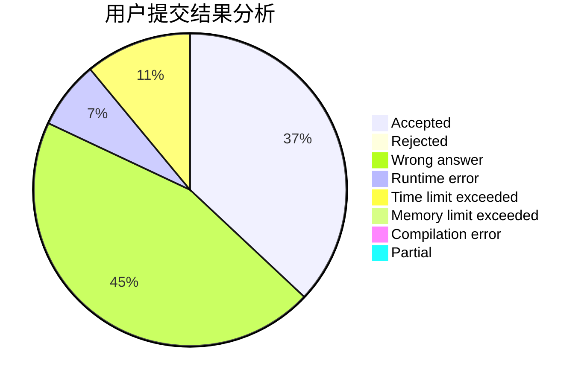
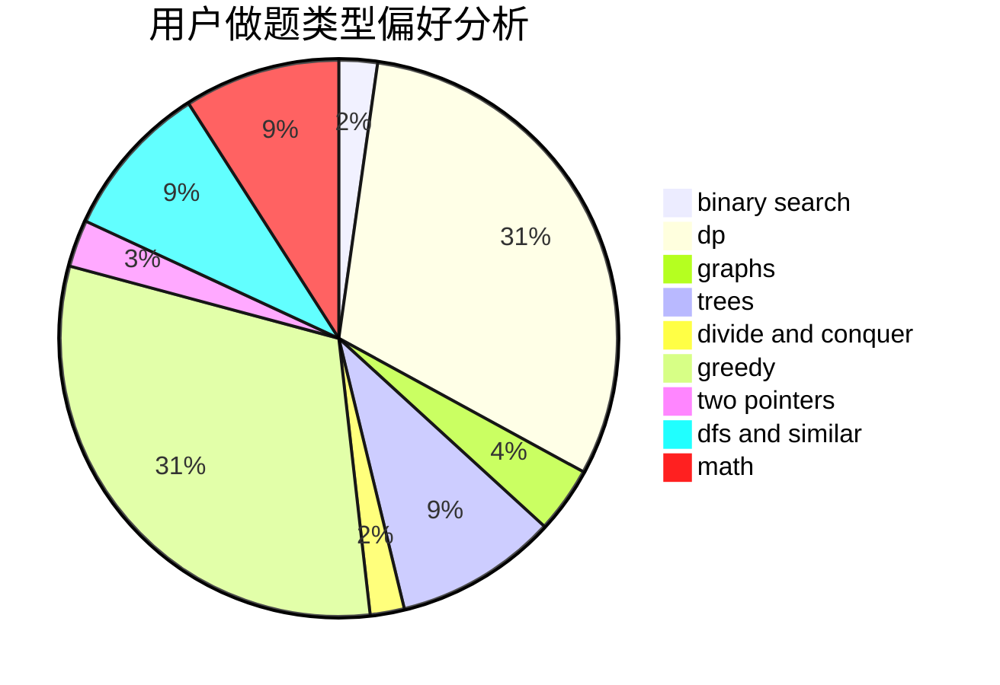

# zhuzhirui2005

<!-- tabs:start -->

#### **用户提交结果分析**

#### **用户做题类型偏好分析**

<!-- tabs:end -->
# 推荐题目
[798C](https://codeforces.com/contest/798/problem/C)
[1185D](https://codeforces.com/contest/1185/problem/D)
[3912](https://codeforces.com/contest/391/problem/2)
[254A](https://codeforces.com/contest/254/problem/A)
[1341E](https://codeforces.com/contest/1341/problem/E)
[740D](https://codeforces.com/contest/740/problem/D)
[1264C](https://codeforces.com/contest/1264/problem/C)
[1174F](https://codeforces.com/contest/1174/problem/F)
[849A](https://codeforces.com/contest/849/problem/A)
[1430E](https://codeforces.com/contest/1430/problem/E)
