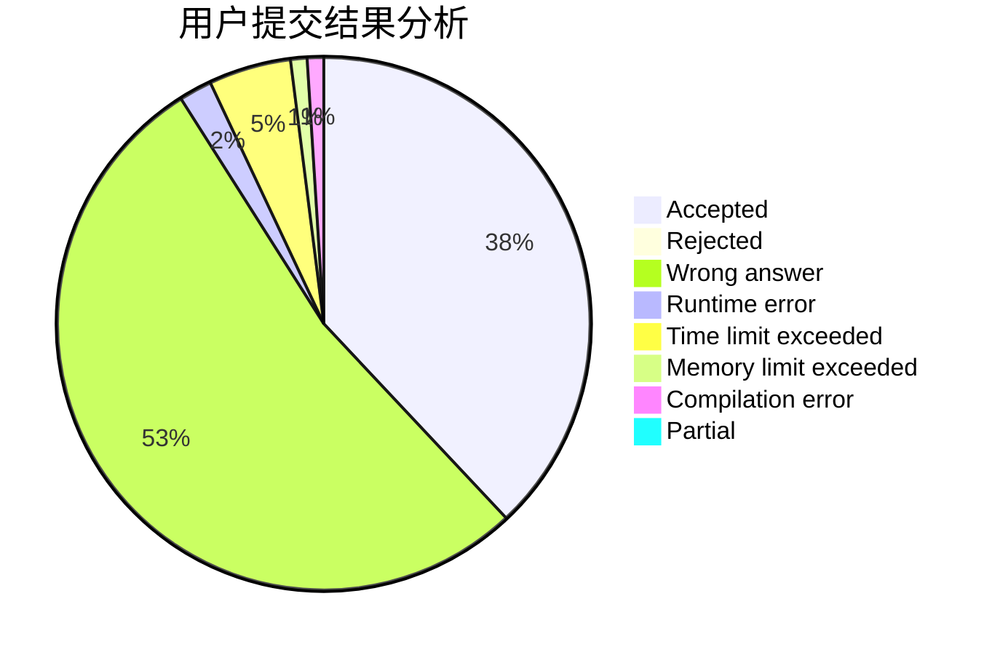
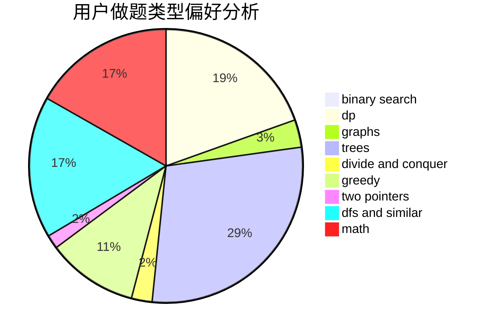

# zhylj

<!-- tabs:start -->

#### **用户提交结果分析**

#### **用户做题类型偏好分析**

<!-- tabs:end -->
# 推荐题目
[1108A](https://codeforces.com/contest/1108/problem/A)
[1255C](https://codeforces.com/contest/1255/problem/C)
[1298D](https://codeforces.com/contest/1298/problem/D)
[1148E](https://codeforces.com/contest/1148/problem/E)
[609E](https://codeforces.com/contest/609/problem/E)
[710B](https://codeforces.com/contest/710/problem/B)
[907D](https://codeforces.com/contest/907/problem/D)
[632B](https://codeforces.com/contest/632/problem/B)
[767E](https://codeforces.com/contest/767/problem/E)
[864D](https://codeforces.com/contest/864/problem/D)
