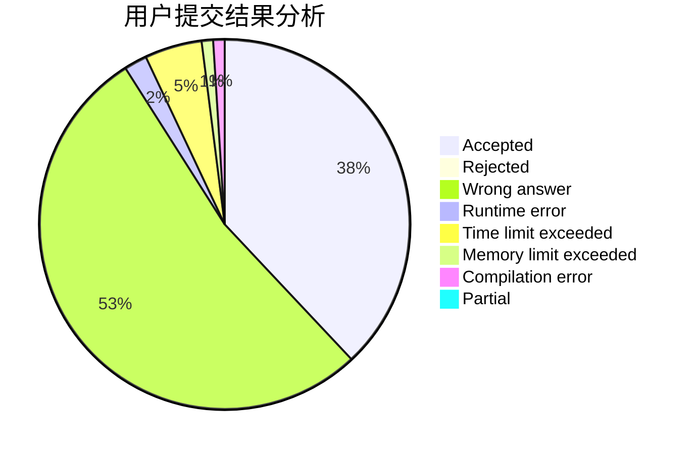
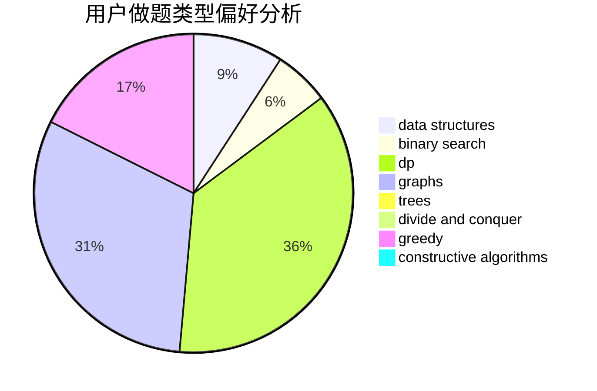
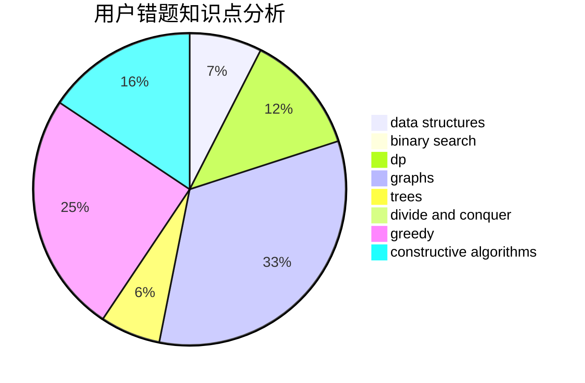

# zhylj

<!-- tabs:start -->

#### **用户提交结果分析**

#### **用户做题类型偏好分析**

#### **用户错题知识点分析**

<!-- tabs:end -->
# 推荐题目
[1107F](https://codeforces.com/contest/1107/problem/F)		dp,
                        flows,
                        graph matchings,
                        graphs,
                        sortings		  
[1250L](https://codeforces.com/contest/1250/problem/L)		binary search,
                        greedy,
                        math		  
[1291E](https://codeforces.com/contest/1291/problem/E)		dsu,graphs,sortings,trees		  
[1146E](https://codeforces.com/contest/1146/problem/E)		bitmasks,
                        data structures,
                        divide and conquer,
                        implementation		  
[58E](https://codeforces.com/contest/58/problem/E)		dp		  
[690A1](https://codeforces.com/contest/690A/problem/1)		nan		  
[888B](https://codeforces.com/contest/888/problem/B)		greedy		  
[612E](https://codeforces.com/contest/612/problem/E)		combinatorics,
                        constructive algorithms,
                        dfs and similar,
                        graphs,
                        math		  
[748D](https://codeforces.com/contest/748/problem/D)		constructive algorithms,
                        data structures,
                        greedy		  
[846B](https://codeforces.com/contest/846/problem/B)		brute force,
                        greedy		  
