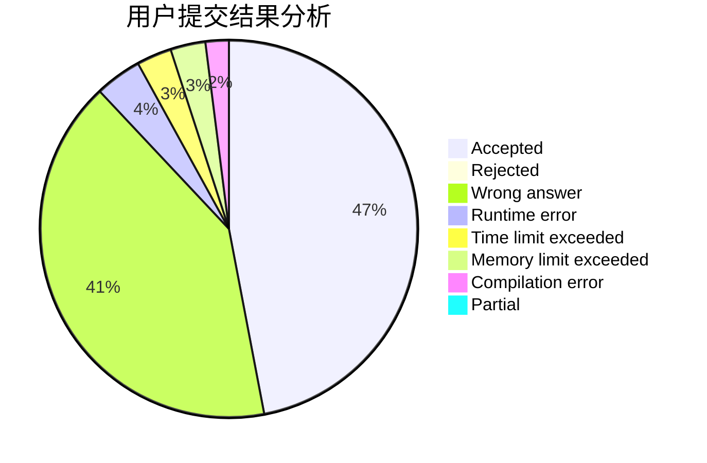
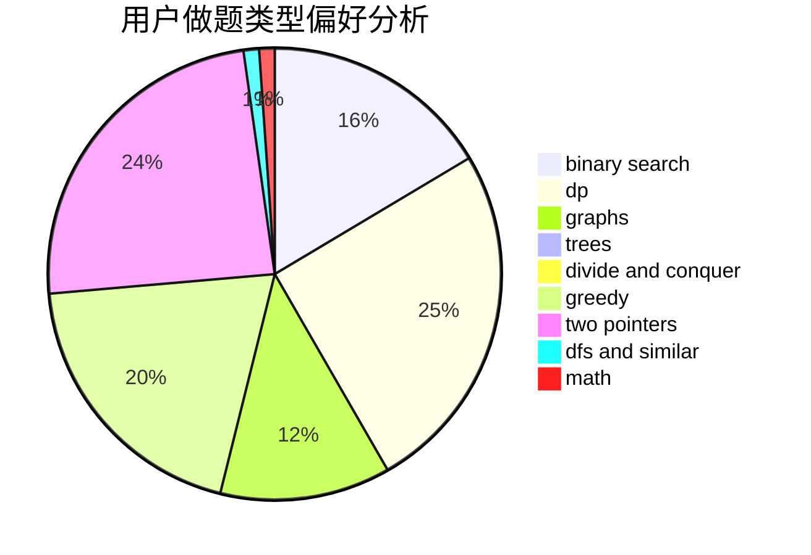

# zhz520

<!-- tabs:start -->

#### **用户提交结果分析**

#### **用户做题类型偏好分析**

<!-- tabs:end -->
# 推荐题目
[1438A](https://codeforces.com/contest/1438/problem/A)
[627F](https://codeforces.com/contest/627/problem/F)
[1083F](https://codeforces.com/contest/1083/problem/F)
[628F](https://codeforces.com/contest/628/problem/F)
[218A](https://codeforces.com/contest/218/problem/A)
[99C](https://codeforces.com/contest/99/problem/C)
[858C](https://codeforces.com/contest/858/problem/C)
[479E](https://codeforces.com/contest/479/problem/E)
[845C](https://codeforces.com/contest/845/problem/C)
[1087D](https://codeforces.com/contest/1087/problem/D)
