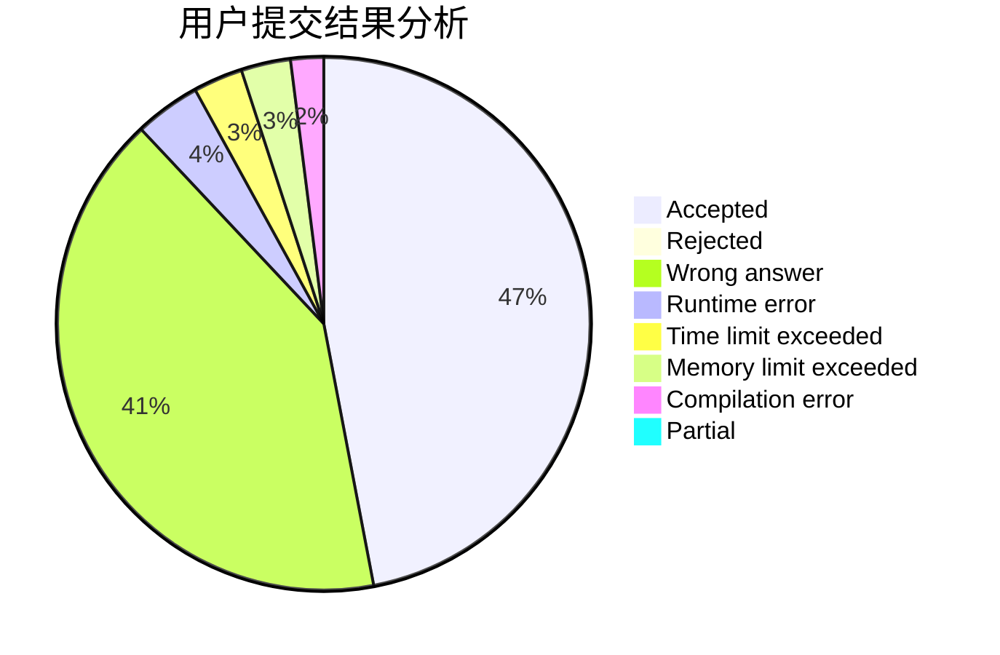
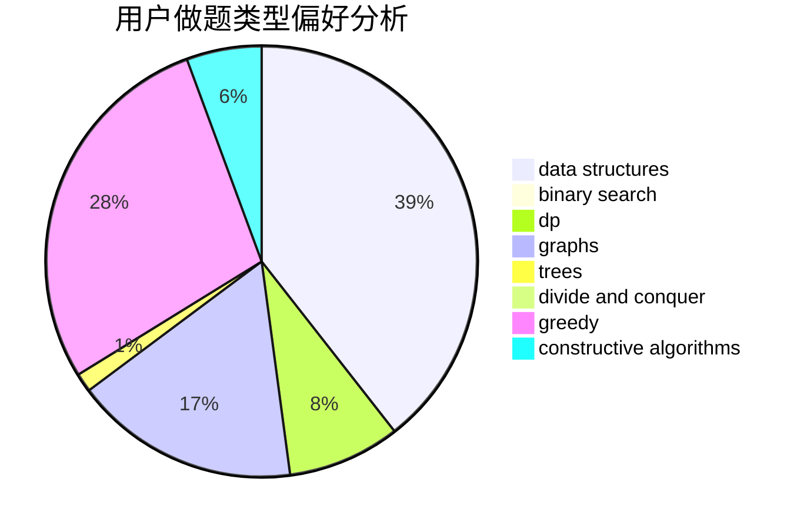
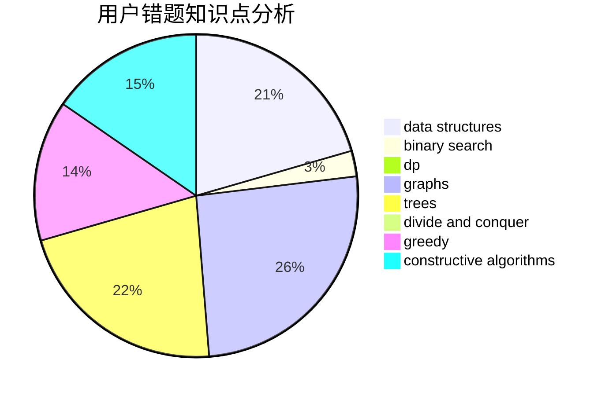

# zhz520

<!-- tabs:start -->

#### **用户提交结果分析**

#### **用户做题类型偏好分析**

#### **用户错题知识点分析**

<!-- tabs:end -->
# 推荐题目
[1438A](https://codeforces.com/contest/1438/problem/A)		constructive algorithms,
                        implementation		  
[627F](https://codeforces.com/contest/627/problem/F)		dfs and similar,
                        dsu,
                        graphs,
                        trees		  
[1083F](https://codeforces.com/contest/1083/problem/F)		data structures		  
[628F](https://codeforces.com/contest/628/problem/F)		flows		  
[218A](https://codeforces.com/contest/218/problem/A)		brute force,
                        constructive algorithms,
                        implementation		  
[99C](https://codeforces.com/contest/99/problem/C)		dsu,graphs,sortings,trees		  
[858C](https://codeforces.com/contest/858/problem/C)		dp,
                        greedy,
                        implementation		  
[479E](https://codeforces.com/contest/479/problem/E)		combinatorics,
                        dp		  
[845C](https://codeforces.com/contest/845/problem/C)		data structures,
                        greedy,
                        sortings		  
[1087D](https://codeforces.com/contest/1087/problem/D)		dsu,graphs,sortings,trees		  
