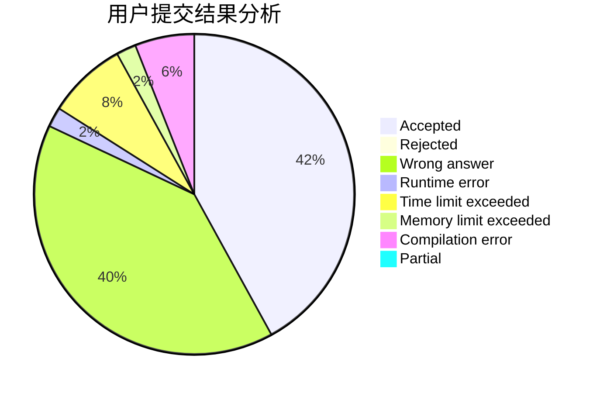
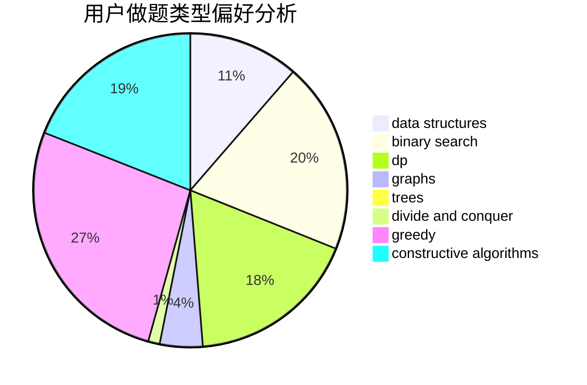

# zialy

<!-- tabs:start -->

#### **用户提交结果分析**

#### **用户做题类型偏好分析**

#### **用户错题知识点分析**

<!-- tabs:end -->
# 推荐题目
[500B](https://codeforces.com/contest/500/problem/B)		dfs and similar,
                        dsu,
                        graphs,
                        greedy,
                        math,
                        sortings		  
[599C](https://codeforces.com/contest/599/problem/C)		sortings		  
[1493F](https://codeforces.com/contest/1493/problem/F)		bitmasks,
                        interactive,
                        number theory		  
[660F](https://codeforces.com/contest/660/problem/F)		binary search,
                        data structures,
                        geometry,
                        ternary search		  
[976E](https://codeforces.com/contest/976/problem/E)		greedy,
                        sortings		  
[907B](https://codeforces.com/contest/907/problem/B)		implementation		  
[704B](https://codeforces.com/contest/704/problem/B)		dp,
                        graphs,
                        greedy		  
[893F](https://codeforces.com/contest/893/problem/F)		data structures,
                        trees		  
[792C](https://codeforces.com/contest/792/problem/C)		dp,
                        greedy,
                        math,
                        number theory		  
[1147C](https://codeforces.com/contest/1147/problem/C)		games		  
