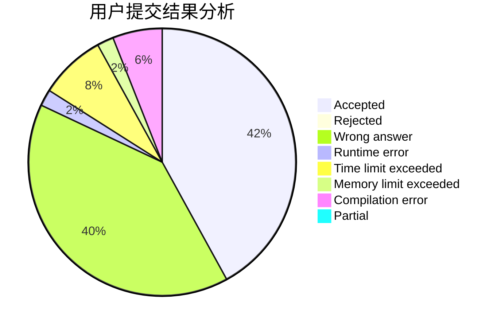
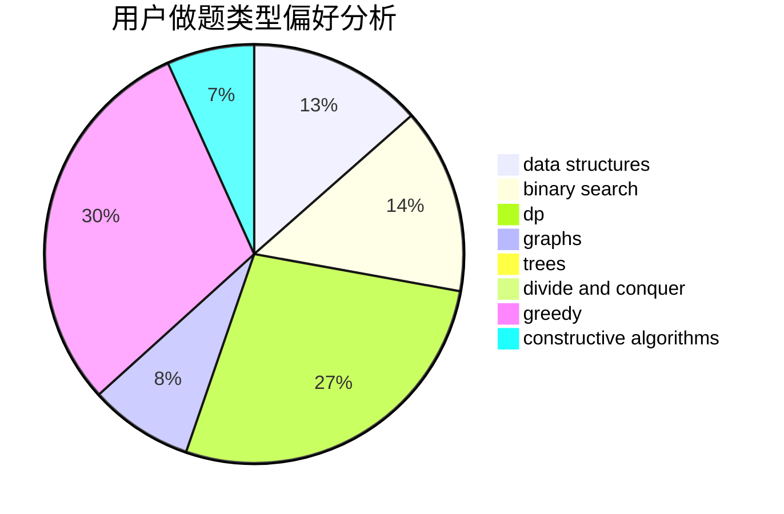

# zialy

<!-- tabs:start -->

#### **用户提交结果分析**

#### **用户做题类型偏好分析**

#### **用户错题知识点分析**

<!-- tabs:end -->
# 推荐题目
[521B](https://codeforces.com/contest/521/problem/B)		dsu,graphs,sortings,trees		  
[617B](https://codeforces.com/contest/617/problem/B)		combinatorics		  
[1501F](https://codeforces.com/contest/1501/problem/F)		dsu,graphs,sortings,trees		  
[681E](https://codeforces.com/contest/681/problem/E)		geometry,
                        sortings		  
[990D](https://codeforces.com/contest/990/problem/D)		constructive algorithms,
                        graphs,
                        implementation		  
[920F](https://codeforces.com/contest/920/problem/F)		brute force,
                        data structures,
                        dsu,
                        number theory		  
[723B](https://codeforces.com/contest/723/problem/B)		expression parsing,
                        implementation,
                        strings		  
[911F](https://codeforces.com/contest/911/problem/F)		constructive algorithms,
                        dfs and similar,
                        graphs,
                        greedy,
                        trees		  
[808B](https://codeforces.com/contest/808/problem/B)		data structures,
                        implementation,
                        math		  
[1149B](https://codeforces.com/contest/1149/problem/B)		dp,
                        implementation,
                        strings		  
