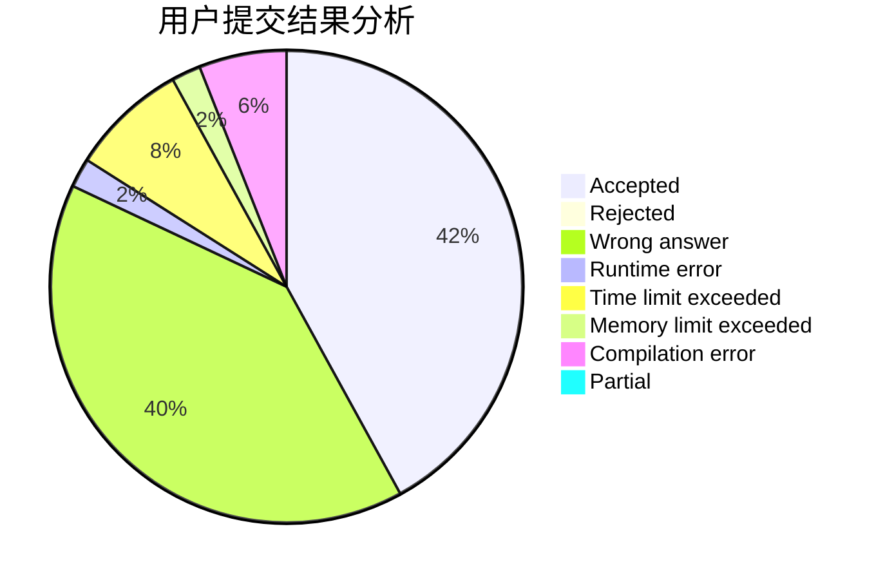
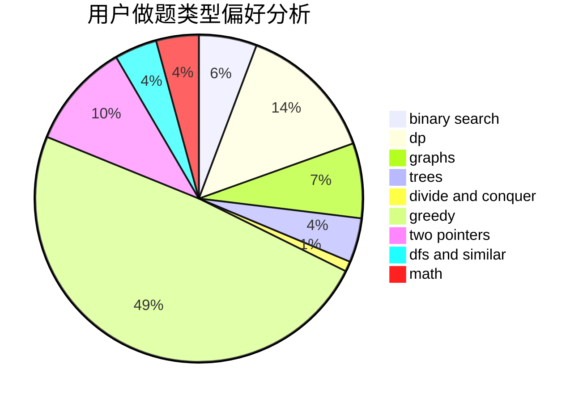

# zialy

<!-- tabs:start -->

#### **用户提交结果分析**

#### **用户做题类型偏好分析**

<!-- tabs:end -->
# 推荐题目
[521B](https://codeforces.com/contest/521/problem/B)
[617B](https://codeforces.com/contest/617/problem/B)
[1501F](https://codeforces.com/contest/1501/problem/F)
[681E](https://codeforces.com/contest/681/problem/E)
[990D](https://codeforces.com/contest/990/problem/D)
[920F](https://codeforces.com/contest/920/problem/F)
[723B](https://codeforces.com/contest/723/problem/B)
[911F](https://codeforces.com/contest/911/problem/F)
[808B](https://codeforces.com/contest/808/problem/B)
[1149B](https://codeforces.com/contest/1149/problem/B)
