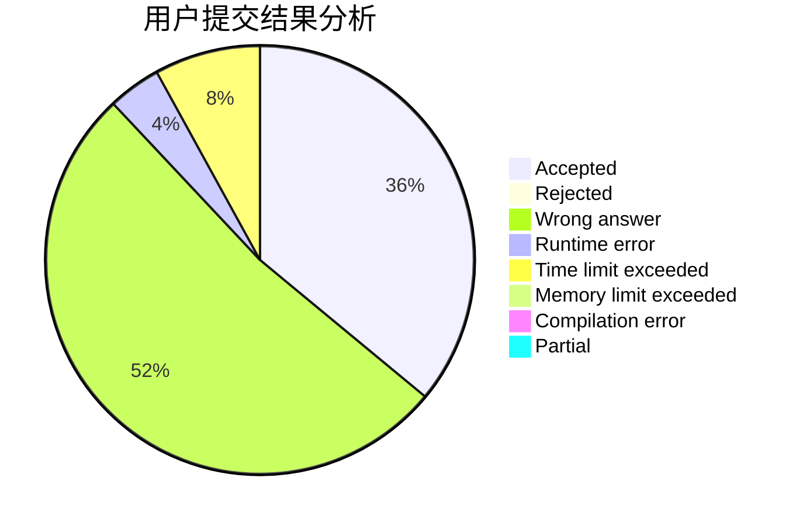
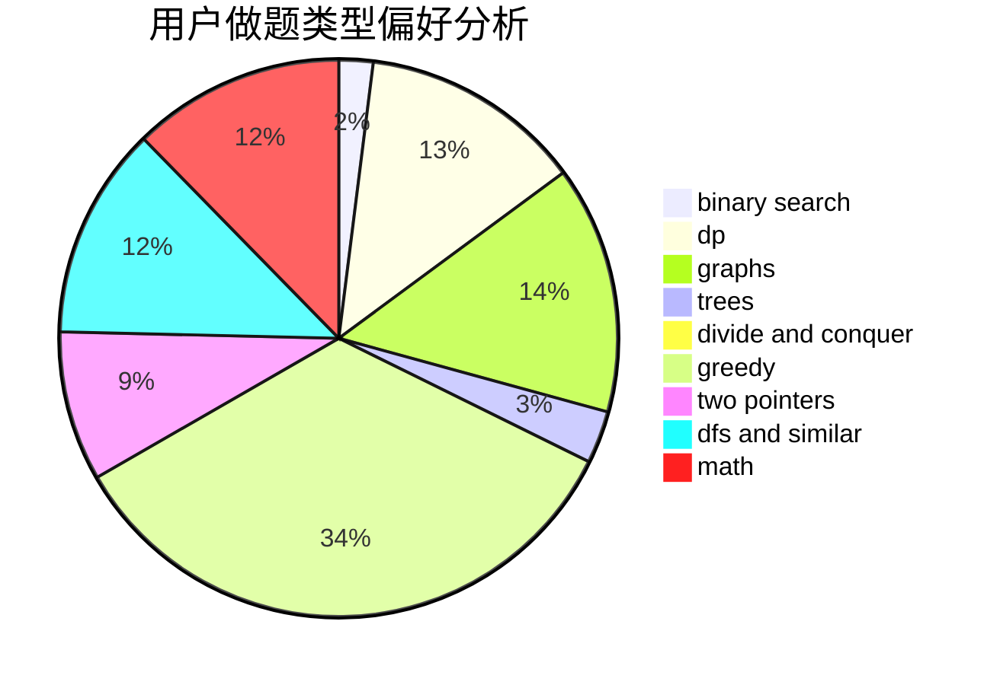

# ChenZhuoYue_hhu

<!-- tabs:start -->

#### **用户提交结果分析**

#### **用户做题类型偏好分析**

<!-- tabs:end -->
# 推荐题目
[304D](https://codeforces.com/contest/304/problem/D)
[1106F](https://codeforces.com/contest/1106/problem/F)
[468A](https://codeforces.com/contest/468/problem/A)
[388B](https://codeforces.com/contest/388/problem/B)
[1310D](https://codeforces.com/contest/1310/problem/D)
[466C](https://codeforces.com/contest/466/problem/C)
[1260D](https://codeforces.com/contest/1260/problem/D)
[549E](https://codeforces.com/contest/549/problem/E)
[1380E](https://codeforces.com/contest/1380/problem/E)
[405A](https://codeforces.com/contest/405/problem/A)
