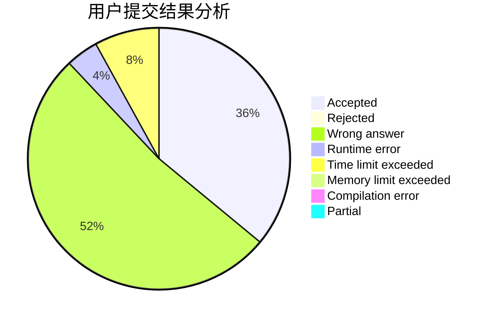
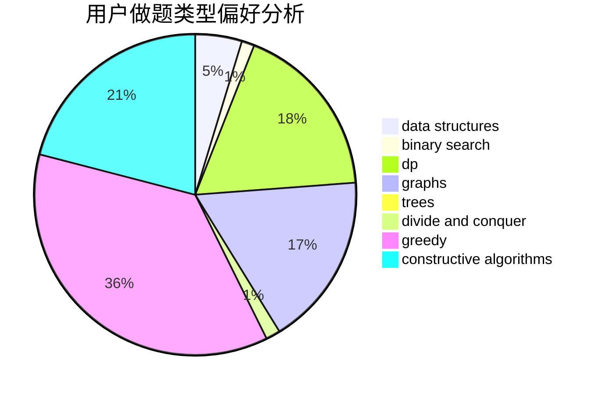

# ChenZhuoYue_hhu

<!-- tabs:start -->

#### **用户提交结果分析**

#### **用户做题类型偏好分析**

#### **用户错题知识点分析**

<!-- tabs:end -->
# 推荐题目
[28D](https://codeforces.com/contest/28/problem/D)		binary search,
                        data structures,
                        dp,
                        hashing		  
[1106C](https://codeforces.com/contest/1106/problem/C)		greedy,
                        implementation,
                        math,
                        sortings		  
[447E](https://codeforces.com/contest/447/problem/E)		dsu,graphs,sortings,trees		  
[360A](https://codeforces.com/contest/360/problem/A)		greedy,
                        implementation		  
[1301A](https://codeforces.com/contest/1301/problem/A)		implementation,
                        strings		  
[446B](https://codeforces.com/contest/446/problem/B)		brute force,
                        data structures,
                        greedy		  
[1253B](https://codeforces.com/contest/1253/problem/B)		greedy,
                        implementation		  
[525B](https://codeforces.com/contest/525/problem/B)		constructive algorithms,
                        greedy,
                        math,
                        strings		  
[1371F](https://codeforces.com/contest/1371/problem/F)		data structures,
                        divide and conquer,
                        implementation		  
[376B](https://codeforces.com/contest/376/problem/B)		implementation		  
