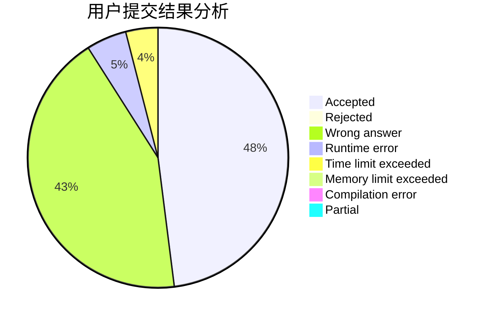
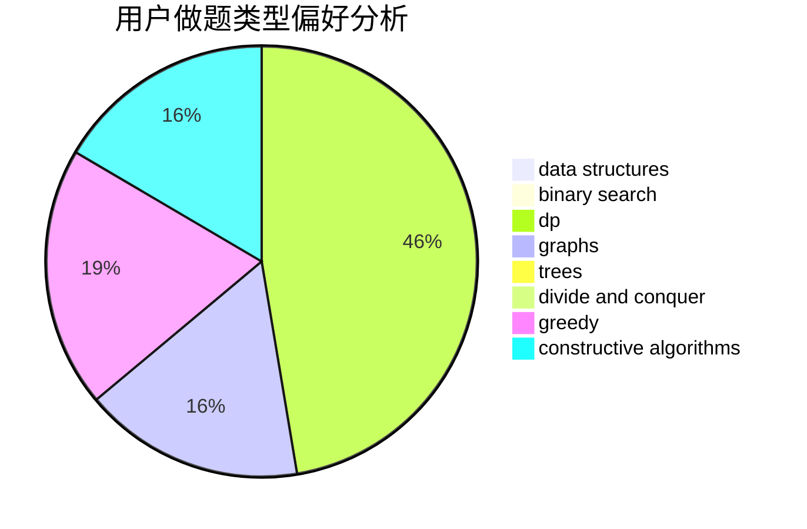
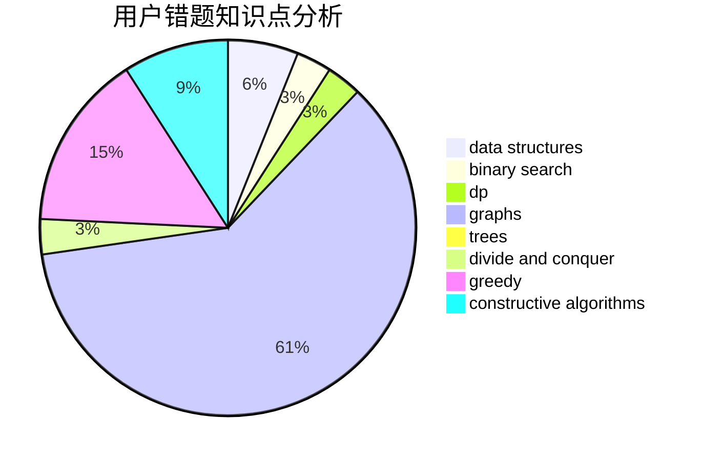

# ziwen

<!-- tabs:start -->

#### **用户提交结果分析**

#### **用户做题类型偏好分析**

#### **用户错题知识点分析**

<!-- tabs:end -->
# 推荐题目
[1238E](https://codeforces.com/contest/1238/problem/E)		bitmasks,
                        dp		  
[856D](https://codeforces.com/contest/856/problem/D)		dp,
                        trees		  
[1159A](https://codeforces.com/contest/1159/problem/A)		implementation,
                        math		  
[1340D](https://codeforces.com/contest/1340/problem/D)		constructive algorithms,
                        dfs and similar,
                        graphs,
                        trees		  
[1045I](https://codeforces.com/contest/1045/problem/I)		hashing,
                        strings		  
[430A](https://codeforces.com/contest/430/problem/A)		constructive algorithms,
                        sortings		  
[817F](https://codeforces.com/contest/817/problem/F)		binary search,
                        data structures,
                        trees		  
[1042B](https://codeforces.com/contest/1042/problem/B)		bitmasks,
                        brute force,
                        dp,
                        implementation		  
[634A](https://codeforces.com/contest/634/problem/A)		constructive algorithms,
                        implementation		  
[588C](https://codeforces.com/contest/588/problem/C)		dsu,graphs,sortings,trees		  
